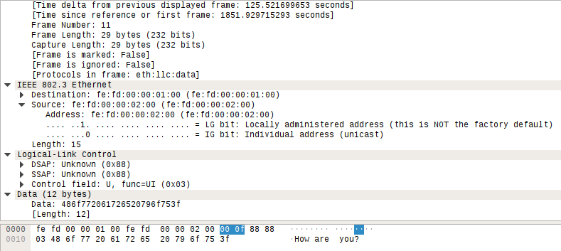
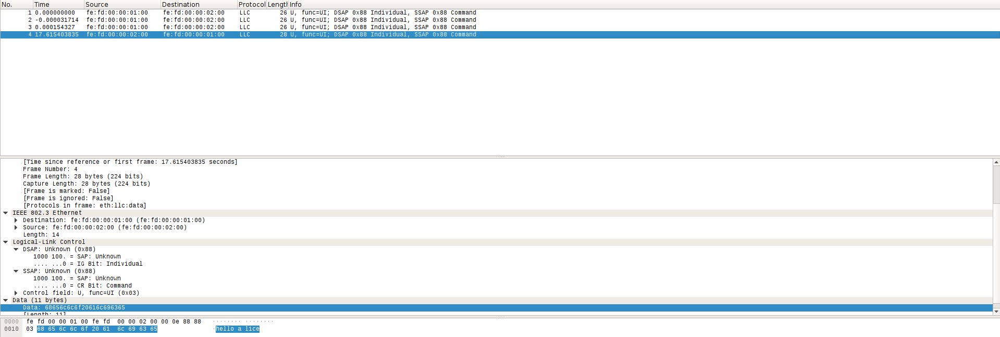
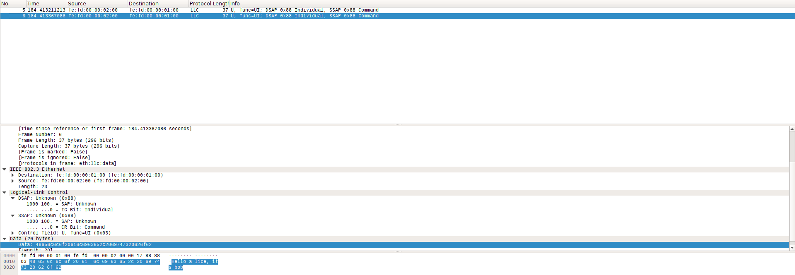
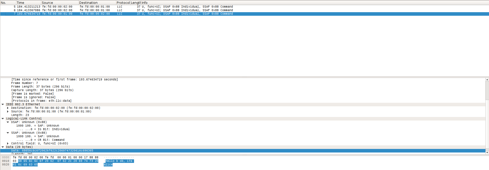
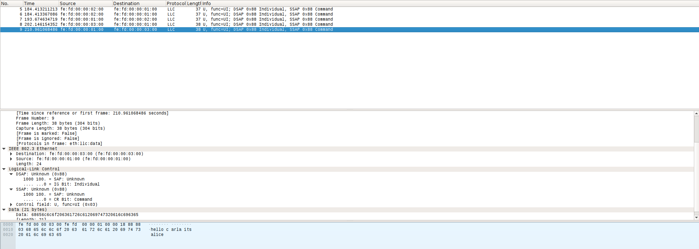
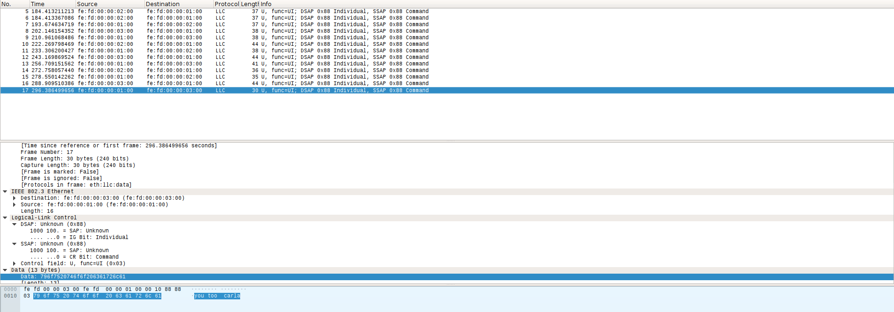
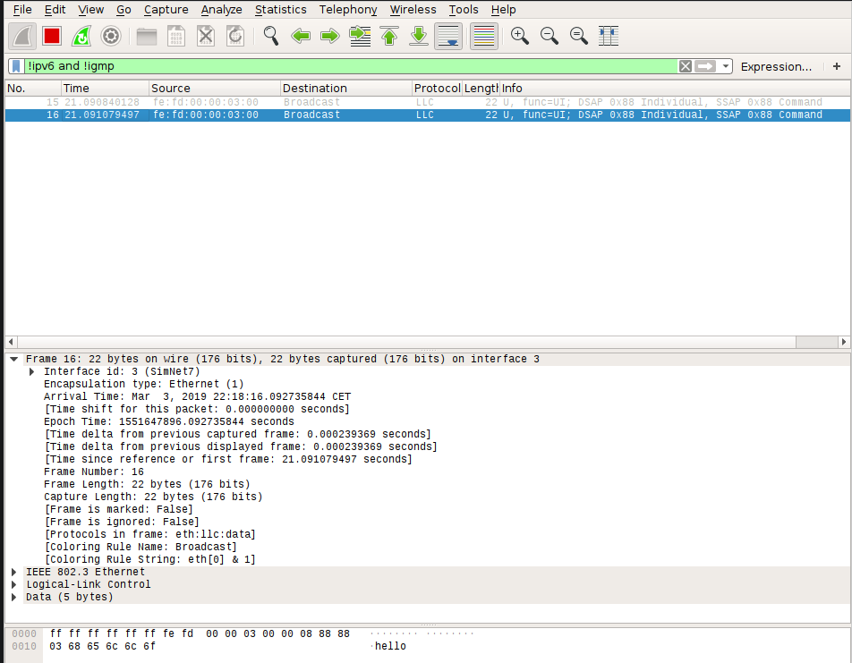

# Practice 1 memo of TCGI

## Exercice 1
### Section 1
First of all, to initialize the simulation, run:
```
simctl switching-vlan start
```

Now we need to retrieve Alices and Bobs machines. To do so, run:
```
simctl switching-vlan get alice
simctl switching-vlan get bob
```
***Note:*** _The default login is root and xxxx as password._

Once we retrieve both terminals, we need to create a chat between both hosts.
We do so by running the server on Alices machine and the client on Bobs. Here
are the used commands:

On Alice:
```
server-chat-LLC1.py
```
Notice that the default parameters are `eth 0` and the SAP `0x88`.

And on Bob:
```
clinet-chat-LLC1.py fe:fd:00:00:01:00 
```

Then, initialize Wireshak by typing `wireshark` on the physical machine.

After exchanging some messages between Bob an Alice, we proceed to analize what
Wireshark has captured:



From inside to outside of the frame:

* On the data field of the LLC frame, we can find what could be the ASCII
	representation of the message _How are you?_ .
* Then, if we take a look on the LLC header: 
	* We can determine that is using the LLC1 protocol by taking a look on 
		the Control field. As it can be seen, it has the value `0x03` which determines LLC
		1.
	* If we now focus on the first two parameters: DSAP and SSAP, we can
		confirm taht the default settings have been applied.
* Now we switch to the Ethernet header as the LLC1 frame is just the data
	parameter of the frame:
	* The first two fields are for the @MAC. By using the command `ifconfig` on
		Alice and Bob, we can confirm they are right.
	* Due to the fact that we are using the LLC protocol, the L/P field will be
		populated by the length of the LLC frame. If we add the length of the
		message (12 bytes) plus the Control field and both SAPs, it results to
		a value of 15, the same as the one on the parameter length.
	
### Section 2
To reproduce the descrived scenario, we have to run two servers on Alice and
then two clients, one on Bob and the other on Carla. Other configurations fail
to work because is the client who starts the comunication. If we run
multiple cients in one machine, once we send a message using one of them, we
lose the hability to interface with the others. 

We could also specify diferent SAPs for each server but it wouldi yield
problems that I don't know how to solve yet

## Exercice 2
### Section 1
First of all we run `brctl show` on L1 and we get this output:

```
bridge name     bridge id               STP enabled     interfaces
br1             8000.fefd00000700       no              eth0
                                                        eth1
                                                        eth2
```
As we can see the spanning tree protocol is not enabled (we don't have any loop
topolgy so it is not needed). The interfaces `eth0`, `eth1` and `eth2` are
assigned to the br1 as shown on the instructions diagram. The same happens with
the other switches, L2 and L3.

Then we run `brctl showmacs br1` on L1 to show the MAC discovery protocol @MAC
table. We can see listed there all the learned @MAC. 
```
port no mac addr                is local?       ageing timer
  1     1a:26:fe:bf:a2:df       no                31.88
  2     42:d2:bc:27:3c:b9       no                33.29	
  3     46:e2:a0:7e:e2:77       no                15.34
  3     4a:3a:4d:ef:a0:f4       no                41.97
  3     4e:54:43:63:23:68       no                21.49
  2     4e:a8:e5:e4:b2:4e       no                32.72
  2     86:9a:01:19:00:c7       no                25.58
  2     fe:9a:be:b5:47:6f       no                37.87
  1     fe:fd:00:00:07:00       yes                0.00
  2     fe:fd:00:00:07:01       yes                0.00
  3     fe:fd:00:00:07:02       yes                0.00

```

In this example output, we can see taht the fisrt parameter is the port number
in witch the switch belives teh machine is connected. The next one is the
phisical @ of the station. The `is local?` parameter refers to teh nature of
the @MAC, if it is `yes` it means the the address belongs to a network card of
the switch or to the bridge itself. We can determine whitch of those
posibilities is by executing `ifconfig | grep HW`. The output is self
explanatory:

```
br1       Link encap:Ethernet  HWaddr fe:fd:00:00:07:00  
eth0      Link encap:Ethernet  HWaddr fe:fd:00:00:07:00  
eth1      Link encap:Ethernet  HWaddr fe:fd:00:00:07:01  
eth2      Link encap:Ethernet  HWaddr fe:fd:00:00:07:02  

```
The other entries of the table can not be identified and I can not figure out
who is the owner. 

The last parameter refers to the amount of time the @MAC has been listed. After
a given number of seconds, they get removed.

### Section 2
After sending an LLC1 frame from Alice to Bob, we analized the @MAC table of
L1. As it can be seen on the output, Alices @MAC has been listed on the exact
port it is connected and ad not local. The ageing timer is also running. After
60s, the address of Alice desapears.

```
port no mac addr                is local?       ageing timer
  1     fe:fd:00:00:01:00       no                 7.29
  1     fe:fd:00:00:07:00       yes                0.00
  2     fe:fd:00:00:07:01       yes                0.00
  3     fe:fd:00:00:07:02       yes                0.00

```
On the other hand, by analizing the captured frame in SimNet1 and SimNet2 we
can see the frame traveling from Alices machine to Bobs. The frame structure is
the same as in the ones captured on Exercise 1. It is worth mentioning that,
due to teh fact that the bridge does not now where is Bobs machine, it
broadcasts the frame to all of its ports. This is why we see the frame on
SimNet2.

### Section 3
Now we send two consecutive frames from Alice to Bob. By sending them before
expiring the @MAC table ageing timer, we can see taht the first one triggers
the MAC Learning Protocol and the second one just resets the timer. Then, when
we send the frame from Bobs machine, Bobs phisical @ gets listed on the table.

This is the output after all the messages have been sent:

```
port no mac addr                is local?       ageing timer
  1     fe:fd:00:00:01:00       no                10.29
  3     fe:fd:00:00:02:00       no                 5.19
  1     fe:fd:00:00:07:00       yes                0.00
  2     fe:fd:00:00:07:01       yes                0.00
  3     fe:fd:00:00:07:02       yes                0.00

```

From the prespective of Wireshark, we can see the same behaviour as on the
previous section on the firts two messages: they get sent through all the
interfaces so we can capture them on SimNet1 and SimNet2. This changes when Bob
sends its reply. Due to the fact that the MAC learning protocol has learned
where Alices frames come from, Bobs frames only get sent through SimNet2 (to
prove that SimNet4 has been checked).



As it can be seen on Image 2, Alices package gets captured three times whereas
Bobs only one.

### Section 4
Now we have two chats, so we now run teh same configuration as in the last
section of exercice 2. It all starts with Bob saying hi to Alice. As shown on
the nest picture, this message gets captured on SimNets 1 and 2 because L2 nor
L1 know where Alices machine is hooked-up. 



Then Alice sends its response to Bob. As we can see, now the frame gets
campured only on SimNet2 because Bobs MAC has been listed on L1 and L2 @MAC
tables. The following image shows this behaviour:



Now it is Carlas turn. Its frame gets only captured on SimNet1. This happens because after arriving on L1 it gets only forwarded to Alice due to the fact that the
previous comunication between Bob and Alice has registered Alices MAC on L1s
table. 

Alices response follows more or less the same pattern. It also only gets capured on SimNet1. L1 only sends the frame through `eth1` because it is where Carlas came from and L3 does the same. Here there is an screen capture of Wireshark at this point:



Now Bob asks Alice how does she do. This frames does not replicate the same
bahaviour than the first one. Now L1 and L2 know where Alices and Bobs stations
are so they only forward the package through the apropiate ports. From now on
this will be the scenario.

This las image shows all teh captured frames and the last frame information:



***Note:*** _This scenario can only be achieved by setting an ageing value high
enough to ensure that the @MACs are not forgotten after the first message._

## Exercice 4
### Section 3
We used the following command to set-up both 10 and 20 VLANs. There was no need
to use tags for this configuration:

```
root@L3:~# brctl addbr br3-10 					
root@L3:~# brctl addif br3-10 eth0
root@L3:~# brctl addif br3-10 eth1
root@L3:~# ifconfig eth0 up
root@L3:~# ifconfig eth1 up 
root@L3:~# ifconfig br3-10 10.0.0.31/24
br3-10: port 1(eth0) entered forwarding state
br3-10: port 2(eth2) entered forwarding state

root@L3:~# brctl addbr br3-20
root@L3:~# brctl addif br3-20 eth2
root@L3:~# brctl addif br3-20 eth3
root@L3:~# ifconfig eth2 up
root@L3:~# ifconfig eth3 up 
root@L3:~# ifconfig br3-20 10.0.0.32/24
br3-10: port 1(eth1) entered forwarding state
br3-10: port 2(eth2) entered forwarding state

```

Both sets of commands do the same. The first line creates the brige with name
`br3-{VLAN ID}`. The two following ones add the needed interfaces for each
VLAN. Then we ensure they are up and set up an IP for each bridge to start
forwarding frames. If we run `brctl show` we get this satisfactory output:

```
root@L3:~# brctl show
bridge name     bridge id               STP enabled     interfaces
br3-10          8000.fefd00000900       no              eth0
                                                        eth2
br3-20			8000.fefd00000901		no              eth1
                                                        eth3

```
While capturing on all SimNets on L3, we send a broadcast frame from Carlas
station. This is the output we get on Wireshark:



As expected, only SimNets 5 and 7 capture the frame.


## Issues
* On exercice number 2.1, errors with two servers, two clients with different
	SAPs.
* On exercice number 3.1, I can not determine who is the owner of the
	unidentified @MACs.
* Is a VLAN defined by its ID? (Exercices 4.1 and 4.2)


## Author

* **Albert Azemar i Rovira** - *Initial work* -
	[albert752](https://github.com/albert752)

## License

This project is licensed under the MIT License - see the
[LICENSE.md](../LICENSE.md) file for details

