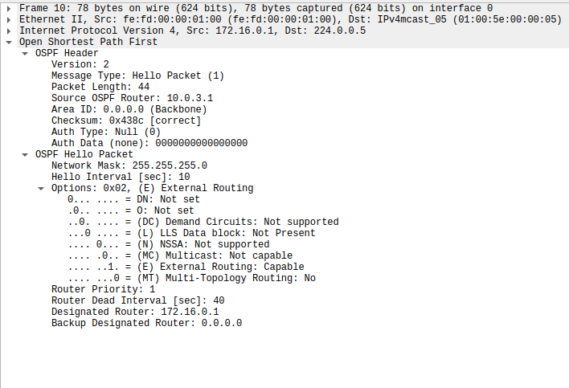
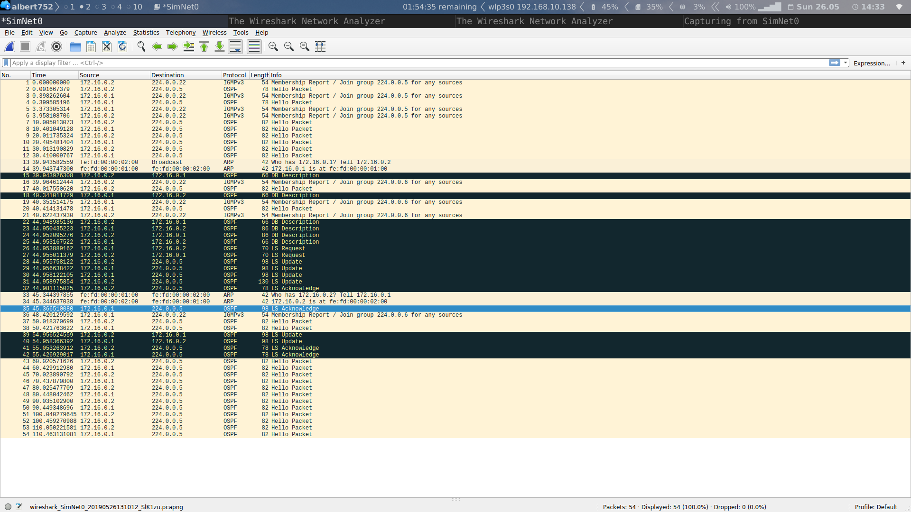
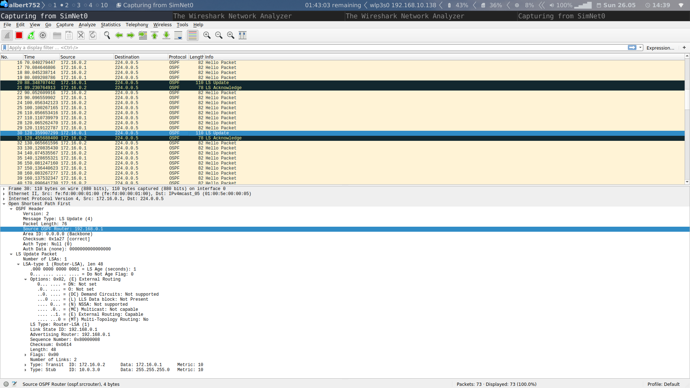

# Practice 10 Memo TCGI
## RIP
### Exercice 1
1. We run the mentioned pings and these are the results:
```
root@r3:~# ping -c10 192.168.2.1
PING 192.168.2.1 (192.168.2.1) 56(84) bytes of data.
64 bytes from 192.168.2.1: icmp_req=1 ttl=64 time=0.688 ms
64 bytes from 192.168.2.1: icmp_req=2 ttl=64 time=0.325 ms
64 bytes from 192.168.2.1: icmp_req=3 ttl=64 time=0.299 ms
64 bytes from 192.168.2.1: icmp_req=4 ttl=64 time=0.291 ms
64 bytes from 192.168.2.1: icmp_req=5 ttl=64 time=0.286 ms
64 bytes from 192.168.2.1: icmp_req=6 ttl=64 time=0.452 ms
64 bytes from 192.168.2.1: icmp_req=7 ttl=64 time=0.517 ms
64 bytes from 192.168.2.1: icmp_req=8 ttl=64 time=0.369 ms
64 bytes from 192.168.2.1: icmp_req=9 ttl=64 time=0.326 ms
64 bytes from 192.168.2.1: icmp_req=10 ttl=64 time=0.305 ms

--- 192.168.2.1 ping statistics ---
10 packets transmitted, 10 received, 0% packet loss, time 9023ms
rtt min/avg/max/mdev = 0.286/0.385/0.688/0.126 ms
```

```
root@r3:~# ping -c10 192.168.3.1
connect: Network is unreachable
```

```
root@r3:~# ping -c10 192.168.4.11
connect: Network is unreachable
```
Due to the fact that no default gateway has been sat, we
can only reach the networks connected directly to the router. 
This is why only the eth2 from r1 responds our request, the
other pings do not even get routed.

2. After running the following commands:

```
root@r3:~# vtysh

Hello, this is Quagga (version 0.99.20.1).
Copyright 1996-2005 Kunihiro Ishiguro, et al.

r3# configure terminal
r3(config)# router rip
r3(config-router)# version 1
r3(config-router)# network 192.168.1.0/24
r3(config-router)# network 192.168.2.0/24
```

In SimNet2 we can see 4 packets. Two IGMP memebership join for the m/c RIP
group and two RIP frames. We'll ignore the m/c frames, the have been 
generated before setting the RIP version and do not correspond to V1.

* **RIP response:** It is sent periodicaly, every 25secs
	* Addrs:
		* L2 addr: Src: fe:fd:00:00:03:02 (fe:fd:00:00:03:02), Dst: Broadcast (ff:ff:ff:ff:ff:ff)
		* L3 addr: Src: 192.168.2.3, Dst: 192.168.2.255
		* L4 addr: User Datagram Protocol, Src Port: 520, Dst Port: 520
	* We can see as expected taht the frames are sent to the broadcast addrs
		and from/to port 520 UDP
	* Payload:
		* Its is advertising the network 192.168.1.0 with metric 1, no mask
			specified.

3. After running `neighbor 192.168.2.1` we set the @IP as a neighbor so unicast
   RIP resposes will be sent to him directly. Due to the fact that eth2 is not
   running RIP, we can see that ICMP error from `192.168.2.1` reporting port unreachable.

4. If we now kill eth3 interface and capture for two minutes on SimNet3, we can
   see that:
	* During the fist two minutes, the metric changes from 1 to 16, so to
	   infinity.
	* After the two minutes, no routes are advertised due to the garbage
		collection.

5. After restoring the link with eth3, we can see the following on SimNet2:
	* We can see a new response with metric 1. It is instantanious so we think
		that it might be set up as triggered.

6. When we remove the net 192.168.1.0/24 for the R3, it inmediatly generates a
   response for this net with metric 16. After 2 minutes, the messages stop.

7. By capturing on SimNet 2, 3, 4 and 6 we can see that, when we run `network
   192.168.0.0/16` on r1:
	* We capture RIP messages on SimNets 2, 3 and 4.
	* The first message is the usual request when we start the RIP protocol.
	* Then, the following ones advertise the complementary two nets that are
		connected to the router for each iface that fit the specified net id.
	* The metric is obviosly 1.
	* Regarding the addres:
		* They all have as src the ip/mac of the iface
		* They all have as dst the broadcast addr.
		* The port is set always to the 520/UDP
	* We can not see any messages on SimNet6 because its @IP does not fit the
		provided NetID, hence RIP has not been activated for that network in
		particular.
8. I think it does not make sense because there aren't any routers connected.
   But, if we don't know the topology of the net (we don't need it to run RIP,
   it is not mandatory), it would be a good idea to send them just in case a
   router gets connected or exist in fisrt place. The again we could use the
   passive mode and wait for a request, lowering the charge of the net.

9. After deleting the network, we don't see any RIP messages, only two IGMP
   leave group. Then, before 2 minutes, when we restore for nets 3.0 and 2.0, we
   can see two requests and the normal responses advertising 0.3 on SimNet2

10. After adding network 5.0, we cannot see any messages from r3 on SimNets 2
	and 3 because those have not been aded to the RIP protocol of r3.
	* After adding the 2.0 net to r3, we can see a request from r3 followed
		from a respons from r1 advertising net 3.0 and also a response from r3
		advertising net 5.0.
	* We can see that both routers have learned the routes:
```
		r1# show ip rip
Codes: R - RIP, C - connected, S - Static, O - OSPF, B - BGP
Sub-codes:
      (n) - normal, (s) - static, (d) - default, (r) - redistribute,
      (i) - interface

     Network            Next Hop         Metric From            Tag Time
C(i) 192.168.2.0/24     0.0.0.0               1 self              0
C(i) 192.168.3.0/24     0.0.0.0               1 self              0
R(n) 192.168.5.0/24     192.168.2.3           2 192.168.2.3       0 02:52

```

```
r3# show ip rip
Codes: R - RIP, C - connected, S - Static, O - OSPF, B - BGP
Sub-codes:
      (n) - normal, (s) - static, (d) - default, (r) - redistribute,
      (i) - interface

     Network            Next Hop         Metric From            Tag Time
C(i) 192.168.2.0/24     0.0.0.0               1 self              0
R(n) 192.168.3.0/24     192.168.2.1           2 192.168.2.1       0 02:56
C(i) 192.168.5.0/24     0.0.0.0               1 self              0
```
.
	* In R1, triggered updates has been set up because whenever we change the
		state of any link, r1 generates a ressponse advertising the new status.
	* We cannot see any response taht matches the poissoned revers behabiour.
	* Split horizon is activated because r3 is not anouncing 0.3 to r1.

11. 
	* When we ping from r3 to 192.168.3.1:
		* The ping works flawlesly
		* It works because r3 has learned the route from r1.
	* When we ping from r3 to 192.168.4.11:
		* It does not work
		* Nwtwork unreachable
		* The net is not inside the rip domain nor it's a direct route.
	* If we examine the RIB and FIB of r3:
**THE RIB FOR RIP**
```
		r3# show ip rip
Codes: R - RIP, C - connected, S - Static, O - OSPF, B - BGP
Sub-codes:
      (n) - normal, (s) - static, (d) - default, (r) - redistribute,
      (i) - interface

     Network            Next Hop         Metric From            Tag Time
C(i) 192.168.2.0/24     0.0.0.0               1 self              0
R(n) 192.168.3.0/24     192.168.2.1           2 192.168.2.1       0 02:42
C(i) 192.168.5.0/24     0.0.0.0               1 self              0

```
**FIB/RIB FOR FOR ALL PROTOCOLS**
```
r3# show ip route
Codes: K - kernel route, C - connected, S - static, R - RIP, O - OSPF,
       I - ISIS, B - BGP, > - selected route, * - FIB route

C>* 127.0.0.0/8 is directly connected, lo
C>* 192.168.0.0/24 is directly connected, eth4
C>* 192.168.1.0/24 is directly connected, eth3
C>* 192.168.2.0/24 is directly connected, eth2
R>* 192.168.3.0/24 [120/2] via 192.168.2.1, eth2, 00:12:11
C>* 192.168.5.0/24 is directly connected, eth1
```

**THE FIB**
```
Kernel IP routing table
Destination     Gateway         Genmask         Flags Metric Ref    Use Iface
192.168.0.0     0.0.0.0         255.255.255.0   U     0      0        0 eth4
192.168.1.0     0.0.0.0         255.255.255.0   U     0      0        0 eth3
192.168.2.0     0.0.0.0         255.255.255.0   U     0      0        0 eth2
192.168.3.0     192.168.2.1     255.255.255.0   UG    2      0        0 eth2
192.168.5.0     0.0.0.0         255.255.255.0   U     0      0        0 eth1
```

We can see that the route to network 4 has not been added but for network 3 it
has.

12. Now we are going to add the net 4 with eth4 in passive mode:
```
r1(config-router)# passive-interface eth4
r1(config-router)# network 192.168.4.0/24
```
	* While capturing on SimNWt4 we only see a RIP request but no responses as
		expected.
	* When we try again the ping, it works.
	* The route to the net 4 has been added to both RIB and FIB like the 3.

13. The RIP responses generated by r222 on SimNet3 advertise networks 0 and 1
	with metric 2 and network 5 with metric 1 as expected.
```
r222# show ip rip
Codes: R - RIP, C - connected, S - Static, O - OSPF, B - BGP
Sub-codes:
      (n) - normal, (s) - static, (d) - default, (r) - redistribute,
      (i) - interface

     Network            Next Hop         Metric From            Tag Time
R(n) 192.168.0.0/24     192.168.5.3           2 192.168.5.3       0 02:51
R(n) 192.168.1.0/24     192.168.5.3           2 192.168.5.3       0 02:51
R(n) 192.168.2.0/24     192.168.3.1           2 192.168.3.1       0 02:51
C(i) 192.168.3.0/24     0.0.0.0               1 self              0
R(n) 192.168.4.0/24     192.168.3.1           2 192.168.3.1       0 02:51
C(i) 192.168.5.0/24     0.0.0.0               1 self              0
```
.
	* As it can be seen, it contains teh two nets that we configured before as wella
		s all the learnet networks form r1 and r3 with the correct number of hops
		(metric)
	* Sending a ping to 172.16.0.1 should not work beacuse it has not note to
		this network.

14. Both routers have routes set outside the scope of RIP. When we run
	`redistribute connected`.
	**Before runing the command**
	```
	r222# show ip route
Codes: K - kernel route, C - connected, S - static, R - RIP, O - OSPF,
       I - ISIS, B - BGP, > - selected route, * - FIB route

C>* 127.0.0.0/8 is directly connected, lo
R>* 192.168.0.0/24 [120/2] via 192.168.5.3, eth2, 00:02:03
C>* 192.168.0.128/25 is directly connected, eth3
R>* 192.168.1.0/24 [120/2] via 192.168.5.3, eth2, 00:02:03
R>* 192.168.2.0/24 [120/2] via 192.168.3.1, eth1, 00:22:42
C>* 192.168.3.0/24 is directly connected, eth1
R>* 192.168.4.0/24 [120/2] via 192.168.3.1, eth1, 00:22:42
C>* 192.168.5.0/24 is directly connected, eth2

	```
	```
	r1# show ip route
Codes: K - kernel route, C - connected, S - static, R - RIP, O - OSPF,
       I - ISIS, B - BGP, > - selected route, * - FIB route

C>* 127.0.0.0/8 is directly connected, lo
C>* 172.16.0.0/16 is directly connected, eth1
R>* 192.168.0.0/24 [120/2] via 192.168.2.3, eth2, 00:03:06
R>* 192.168.1.0/24 [120/2] via 192.168.2.3, eth2, 00:03:06
C>* 192.168.2.0/24 is directly connected, eth2
C>* 192.168.3.0/24 is directly connected, eth3
C>* 192.168.4.0/24 is directly connected, eth4
R>* 192.168.5.0/24 [120/2] via 192.168.3.222, eth3, 00:23:44

	```
	**After running the commmand**
	```
	r222# show ip route
Codes: K - kernel route, C - connected, S - static, R - RIP, O - OSPF,
       I - ISIS, B - BGP, > - selected route, * - FIB route

C>* 127.0.0.0/8 is directly connected, lo
R>* 172.16.0.0/16 [120/2] via 192.168.3.1, eth1, 00:03:21
R>* 192.168.0.0/24 [120/2] via 192.168.5.3, eth2, 00:07:15
C>* 192.168.0.128/25 is directly connected, eth3
R>* 192.168.1.0/24 [120/2] via 192.168.5.3, eth2, 00:07:15
R>* 192.168.2.0/24 [120/2] via 192.168.3.1, eth1, 00:27:54
C>* 192.168.3.0/24 is directly connected, eth1
R>* 192.168.4.0/24 [120/2] via 192.168.3.1, eth1, 00:27:54
C>* 192.168.5.0/24 is directly connected, eth2
	```
	```
	<r1# show ip route  
Codes: K - kernel route, C - connected, S - static, R - RIP, O - OSPF,
       I - ISIS, B - BGP, > - selected route, * - FIB route

C>* 127.0.0.0/8 is directly connected, lo
C>* 172.16.0.0/16 is directly connected, eth1
R>* 192.168.0.0/24 [120/2] via 192.168.2.3, eth2, 00:08:29
R>* 192.168.1.0/24 [120/2] via 192.168.2.3, eth2, 00:08:29
C>* 192.168.2.0/24 is directly connected, eth2
C>* 192.168.3.0/24 is directly connected, eth3
C>* 192.168.4.0/24 is directly connected, eth4
R>* 192.168.5.0/24 [120/2] via 192.168.3.222, eth3, 00:29:07
	```
	* We can see taht the 172.16.0.0/16 network gets distributed whereas the
		192.16.0.128/28 does not because it is not a classfull net.
	* There are no diferences in the entries.

15. Now that r222 has the route, the ping works. RIPv1 is a classfull protocol
	hence it will only distribute classful @IP.
16. The ping form h223 to h11 does not work. The request reaches the host and
	it generates a response. This response can not be routed by r1.
	* On SimNet7 we can see some ARP messages from r3 reqeusting the @MACof
		h223.
	The request goes from h223 to h11 through SimNet3. 
	The response goes from h11 to r1 who routes it to r3 due to the entry
	192.168.0.0/24. R3 tries to reach the host on network 0 (because it fits
	the mask) and generates an ICMP network unreachable that get fw to SimNet4.

### Exercice 2
1. After setting up teh scenario, we can ping h11 from h223. We can see that it
   succeds. If we check the RIB table of r3:
```
r3# show ip route
Codes: K - kernel route, C - connected, S - static, R - RIP, O - OSPF,
       I - ISIS, B - BGP, > - selected route, * - FIB route

C>* 127.0.0.0/8 is directly connected, lo
R>* 172.16.0.0/16 [120/2] via 192.168.2.1, eth2, 00:04:45
C>* 192.168.0.0/24 is directly connected, eth4
R>* 192.168.0.128/25 [120/2] via 192.168.5.222, eth1, 00:04:45
C>* 192.168.1.0/24 is directly connected, eth3
C>* 192.168.2.0/24 is directly connected, eth2
R>* 192.168.3.0/24 [120/2] via 192.168.2.1, eth2, 00:04:45
R>* 192.168.4.0/24 [120/2] via 192.168.2.1, eth2, 00:04:45
C>* 192.168.5.0/24 is directly connected, eth1
```
.
	* We can see entries for all the networks, including the ones that are not
		classfull.
	* We can see entries fro all nets on the rip messages.

2. We add the lo interfaces with `ip address add @IP dev lo` and `network @IP/32`:
	* If we ping from h11 we can reach all the routers.
```
r1# show ip route
Codes: K - kernel route, C - connected, S - static, R - RIP, O - OSPF,
       I - ISIS, B - BGP, > - selected route, * - FIB route

C>* 127.0.0.0/8 is directly connected, lo
C>* 172.16.0.0/16 is directly connected, eth1
R>* 192.168.0.0/24 [120/2] via 192.168.2.3, eth2, 00:09:51
R>* 192.168.0.128/25 [120/2] via 192.168.3.222, eth3, 00:09:52
R>* 192.168.1.0/24 [120/2] via 192.168.2.3, eth2, 00:09:51
C>* 192.168.2.0/24 is directly connected, eth2
C>* 192.168.3.0/24 is directly connected, eth3
C>* 192.168.4.0/24 is directly connected, eth4
R>* 192.168.5.0/24 [120/2] via 192.168.3.222, eth3, 00:09:52
C>* 192.168.100.1/32 is directly connected, lo
R>* 192.168.100.3/32 [120/2] via 192.168.2.3, eth2, 00:06:47
R>* 192.168.100.4/32 [120/3] via 192.168.2.3, eth2, 00:03:44
R>* 192.168.100.222/32 [120/2] via 192.168.3.222, eth3, 00:09:52

```

```
r4# show ip route
Codes: K - kernel route, C - connected, S - static, R - RIP, O - OSPF,
       I - ISIS, B - BGP, > - selected route, * - FIB route

C>* 127.0.0.0/8 is directly connected, lo
C>* 172.16.0.0/16 is directly connected, eth2
R>* 192.168.0.0/24 [120/2] via 192.168.1.3, eth1, 00:05:24
R>* 192.168.0.128/25 [120/3] via 192.168.1.3, eth1, 00:05:24
C>* 192.168.1.0/24 is directly connected, eth1
R>* 192.168.2.0/24 [120/2] via 192.168.1.3, eth1, 00:05:24
R>* 192.168.3.0/24 [120/3] via 192.168.1.3, eth1, 00:05:24
R>* 192.168.4.0/24 [120/3] via 192.168.1.3, eth1, 00:05:24
R>* 192.168.5.0/24 [120/2] via 192.168.1.3, eth1, 00:05:24
R>* 192.168.100.1/32 [120/3] via 192.168.1.3, eth1, 00:05:24
R>* 192.168.100.3/32 [120/2] via 192.168.1.3, eth1, 00:05:24
C>* 192.168.100.4/32 is directly connected, lo
R>* 192.168.100.222/32 [120/3] via 192.168.1.3, eth1, 00:05:24
```
We can see listed entries for all the lo interfaces as well as all the other
networks.

3. After several seconds we can see taht the RIB changes:

```
r1# show ip route
Codes: K - kernel route, C - connected, S - static, R - RIP, O - OSPF,
       I - ISIS, B - BGP, > - selected route, * - FIB route

C>* 127.0.0.0/8 is directly connected, lo
C>* 172.16.0.0/16 is directly connected, eth1
R>* 192.168.0.0/24 [120/3] via 192.168.3.222, eth3, 00:02:59
R>* 192.168.0.128/25 [120/2] via 192.168.3.222, eth3, 00:08:03
R>* 192.168.1.0/24 [120/3] via 192.168.3.222, eth3, 00:02:59
C>* 192.168.2.0/24 is directly connected, eth2
C>* 192.168.3.0/24 is directly connected, eth3
C>* 192.168.4.0/24 is directly connected, eth4
R>* 192.168.5.0/24 [120/2] via 192.168.3.222, eth3, 00:08:03
C>* 192.168.100.1/32 is directly connected, lo
R>* 192.168.100.3/32 [120/3] via 192.168.3.222, eth3, 00:02:59
R>* 192.168.100.4/32 [120/4] via 192.168.3.222, eth3, 00:02:59
R>* 192.168.100.222/32 [120/2] via 192.168.3.222, eth3, 00:08:03

```
The results are:
	* Now the default gateway to reach SimNet0  and all the other routes that
		used the broken link is r222.
	* If we take a look to the response messages, at some point, r1 generates a
		response with only pne metric: `IP Address: 192.168.0.0, Metric: 16`
		meaning that the link is now broken. Then it will anonunce that its not
		capable of reaching 100.3 and 100.4 and then 1.0. Now it changes its RIB.

4. If we try to ping r3 from h11:
	* It works
	* After running `traceroute` we can conclude that:
		* The first hop is r1
		* The second one is r222
		* And the last one r3
	* It is teh optimal path with this link down.

* If we try to do the same to r4:
	* It works
	* After running `traceroute` we can conclude that:
		* The hops are r1, r222, r3 and finally r4
		* It would be better to go through SimNet6
		* We could activate RIP on r1 eth1 (172.16.0.0/16)

5. We add the static route with `r1(config)# ip route 10.10.10.10/24 172.16.0.5`
	and the redistribute it with `r1(config-router)# redistribute static`.
	* The path taken is r3, r4 and finaly to r5.
	* The path is the optimal.
	* The network is anonunced with metric 1 in SimNet3 by r1 and with also metric 1.

6. We could originate default routes at r1 and r4 because they have acces
   to r5. We are going to configure r1:
    * `root@r1:~# route add default gw 172.16.0.5`
    * `r1(config-router)# default-information originate`
	* Now both pings form h11 and h33 to the internet work.
	* Pings from h11 follow the path: r1, r5
	* Pings form h33 follow the path: r3, r4, r1, r5.
	* We could improve the path adding the default route to r4 or changin the
		advertised next hop to the r5 interface:
## OSPF
### Exercice 3
1. In order to activate OSPF on r1 for eth0 in area 0 we run:
```
r1(config)# router ospf
r1(config-router)# network  172.16.0.0/24 area 0
```
.
	* The OSPF database is the following:
```
OSPF Routing Process, Router ID: 10.0.3.1
 Supports only single TOS (TOS0) routes
 This implementation conforms to RFC2328
 RFC1583Compatibility flag is disabled
 OpaqueCapability flag is disabled
 Initial SPF scheduling delay 200 millisec(s)
 Minimum hold time between consecutive SPFs 1000 millisec(s)
 Maximum hold time between consecutive SPFs 10000 millisec(s)
 Hold time multiplier is currently 1
 SPF algorithm last executed 1m47s ago
 SPF timer is inactive
 Refresh timer 10 secs
 Number of external LSA 0. Checksum Sum 0x00000000
 Number of opaque AS LSA 0. Checksum Sum 0x00000000
 Number of areas attached to this router: 1

 Area ID: 0.0.0.0 (Backbone)
   Number of interfaces in this area: Total: 1, Active: 1
   Number of fully adjacent neighbors in this area: 0
   Area has no authentication
   SPF algorithm executed 1 times
   Number of LSA 1
   Number of router LSA 1. Checksum Sum 0x000093db
   Number of network LSA 0. Checksum Sum 0x00000000
   Number of summary LSA 0. Checksum Sum 0x00000000
   Number of ASBR summary LSA 0. Checksum Sum 0x00000000
   Number of NSSA LSA 0. Checksum Sum 0x00000000
   Number of opaque link LSA 0. Checksum Sum 0x00000000
   Number of opaque area LSA 0. Checksum Sum 0x00000000
```
.
	* As it can be see the router id 10.0.3.1
	* If we take a look to the SimNet we can see:
		* The 5th Hello message includes now the designated router witch is
			himself
			* The previous message included him in the m/c group of DR in order
				to listen for LSU (224.0.0.6).
		* We can also see other m/c join for the OSPF router group (224.0.0.5)
		* The hello messages include the router priority set to 1 and other
			parameters:

.
	* After deactivating OSPF on eth0, we can see two IGMP leave group reports.

2. We create the scenario by running:
First: 

```
root@r1:~# ip address add 192.168.0.1/32 dev lo
r1(config-router)# router-id 192.168.0.1
```
And the same for r2 with its @IP. And then, almost at the same time, we run:
```
network 172.16.0.0/24 area 0
```

We can see that, after the first two packets, hello frames have the active
neighbour field activated with each others @IP. After some other hello packets,
the r2 send to the r1 the database description (r2 is the master because they
both have the same priority but r2 has a higher @IP). After that r2 is set to
DR and r1 to BDR. Then r1 sends the database description to r1 and they both
join the DR m/c group. Finaly, with LSUpdates, LSAck and LSReq; they exchange
the whole database.



3. We used the command `network 10.0.3.0^C4 area 0` on r1 to add the net to
   area 0. We can see that r1 generates an LSUpdate to the m/c DR group and gets
   LSAck by r2. Then, after some hello packets, r2 generates an LSUpdate for
   the m/c group of all OSPF routers.
   * The net gets advertised as transit.


4. To do so, we run:
	* `ip address add @IP dev lo`
	* `(configure-router) router-id @IP`
	* `network @IPs`
Once done, we can see that on SimNet0:
	* r3 asks for the DR, witch is the r2
	* r3 becomes the master and sends the db description to r2 unicast
	* r2 and r1 respond with their db description, unicast
	* Once done, r2 and r1 as well as r3 request information to each other and
		send LSUpdates in response (Request in unicast, response in m/c and
		unicast). Responses in m/c are updated with the nets introduced by
		r3.
		There are multiple messages exchanged.
	* LSAcks are exchanged to validate the flames untill they reach the FULL
		state.

5. In order to add `10.0.4.0/24` to the ospf, we run the network command on r2
   (DR). Because r2 is the DR, it automatically generates an LSUpdate to the
   m/c group 224.0.0.5 witch represents all OSPF routers. This mesages gets
   LSAcked by r3 via 224.0.0.6 and by r1 (BDR) via 224.0.0.5.

6. We use the same commands as before. We can see a dialog in witch r4 asks for
   the information to r2 and r1 (being r4 the master) and r2 sending updates to
   the m/c group that are LSAcked by r3 adn r4 via m/c 6 and by r1 via m/c 5.

7. We add the net with the normal network command. We can see that:
	* r4 sends and LSUpdate to m/c 6
	* r2 fw this LSUpdate to m/c 5
	* r1 and r3 LSAck the message via m/c 5 and 6.

8. To stop the OSPF in r2 we run `no router ospf`. We can see that, after some
   LSUpdates, the new DR is r1 and the BDR is r4 as expected.
 
9. After adding the subnet to r3, we can see an LSUpdate to m/c 6 of LSA type 1
   that gets fw br the DR r1 to the m/c 5. Then r3 generates the apropiate
   LSUpdate with an LSA type 3 summary with the subnet 10.0.1.0/24. This
   message gets fw also by the DR with the same m/c addr and finally r4 sends
   an LSAck to confirm the two updates to m/c 5.

10. We configure r6:
```
r6(config-router)# router-id  192.168.0.6
r6(config-router)# network  10.0.2.0/24 area 2
r6(config-router)# no network  10.0.1.0/24 area 1
r6(config-router)# area 2 stub no-summary
```
Ad we do the same to r4. We can see that:
* On SimNet0 and SimNet1:
	* We can see the anouncement of 10.0.2.0 by r4 and r3 with type 3 LSA.
* On SimNet3
	* There are only type 1 and 2 LSAs as expected.
	* We can see not LSA type 3 for the default route.
If we take a look to the r6 learned routes:
```
 OSPF Routing Process, Router ID: 192.168.0.6
 Supports only single TOS (TOS0) routes
 This implementation conforms to RFC2328
 RFC1583Compatibility flag is disabled
 OpaqueCapability flag is disabled
 Initial SPF scheduling delay 200 millisec(s)
 Minimum hold time between consecutive SPFs 1000 millisec(s)
 Maximum hold time between consecutive SPFs 10000 millisec(s)
 Hold time multiplier is currently 1
 SPF algorithm last executed 9m06s ago
 SPF timer is inactive
 Refresh timer 10 secs
 Number of external LSA 0. Checksum Sum 0x00000000
 Number of opaque AS LSA 0. Checksum Sum 0x00000000
 Number of areas attached to this router: 1

 Area ID: 0.0.0.2 (Stub, no summary)
   Shortcutting mode: Default, S-bit consensus: no
   Number of interfaces in this area: Total: 1, Active: 1
   Number of fully adjacent neighbors in this area: 1
   Area has no authentication
   Number of full virtual adjacencies going through this area: 0
   SPF algorithm executed 22 times
 Number of LSA 4
   Number of router LSA 2. Checksum Sum 0x000163ff
   Number of network LSA 1. Checksum Sum 0x0000cb2f
   Number of summary LSA 1. Checksum Sum 0x00006f81
   Number of ASBR summary LSA 0. Checksum Sum 0x00000000
   Number of NSSA LSA 0. Checksum Sum 0x00000000
   Number of opaque link LSA 0. Checksum Sum 0x00000000
   Number of opaque area LSA 0. Checksum Sum 0x00000000

```
We cannot loacate any LSA type 3 as expected.

11. We can see the update on SimNet0, 1 but not on 2 because it has been set up
	as stubby. The route is dsitributed by r3 in SimNet0 with a type5 LSA
	followed with a type4 LSA anouncing r3 as the gateway to reach the type 5
	anouncement.

The ping reaches the host beacuse it has r4 as a deault gateway.

12. We can redsitribute the information on r5 `r5(config-router)# default-information originate`.
	* We can see on SimNet1 a type 5 LSA anouncing the default route in the
		area
	* On SimNet0 we can see that r3 forwards the type 5 LSA and then a LSA type
		4 to set himself as the gateway.

13. To list the border routers taht r1 has we run:
```
r1# show ip ospf border-routers
============ OSPF router routing table =============
R    192.168.0.3           [10] area: 0.0.0.0, ABR
                           via 172.16.0.3, eth0
R    192.168.0.4           [10] area: 0.0.0.0, ABR
                           via 172.16.0.4, eth0
R    192.168.0.5        IA [20] area: 0.0.0.0, ASBR
                           via 172.16.0.3, eth0
```

We see listed the active routers than are located on the edge of the areas.
Once the link is down, we can see that r3 generates a LSA type 4 with age 3600.
And r4 does the same.

Now r has the following border routers:
```
r1# show ip ospf border-routers
============ OSPF router routing table =============
R    192.168.0.3           [10] area: 0.0.0.0, ABR
                           via 172.16.0.3, eth0
R    192.168.0.4           [10] area: 0.0.0.0, ABR
                           via 172.16.0.4, eth0
```
As it can be seen r5 is not listed any more.

If we restore the link:
* There are the typical type 5 and 4 LSAs as if the net has been just added.
## Issues
* Is adding an interface the same as adding its network?
* When we run a no network, why it does not get anounced through the net?
	(RIPv1-9)
* 192.16.0.128/28 does not because it is not a classfull net? (RIPv1-14)
* Why metric 1 in both cases? (RIPv2-5)
* How to change net hop on the default route (RIPv2-5)
* Chaotic capture when we introduce r3 to the ospf. (OSPF-4)
* Chaotic dialog when r2 leaves. (OSPF-8)
* Type 3 LSA not seen on 10? (OSPF-10)
* Why that age? (OSPF-13)
