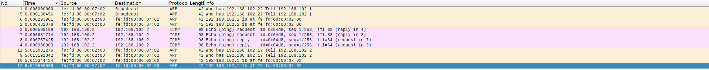
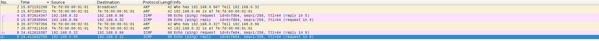
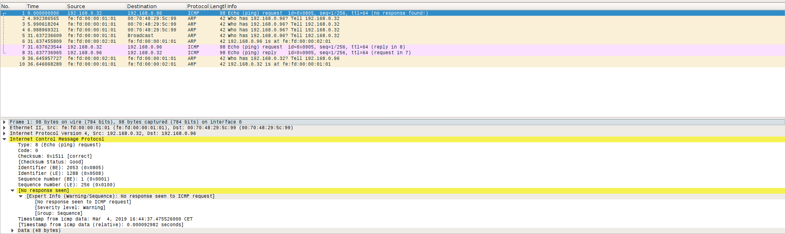
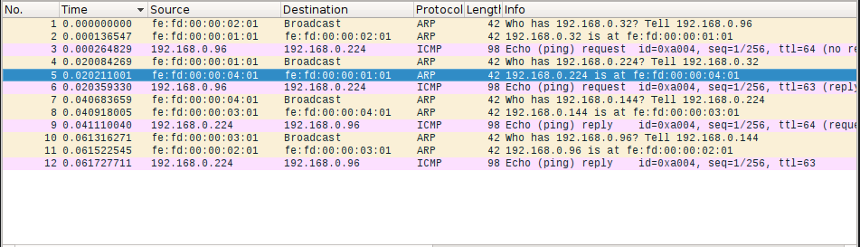
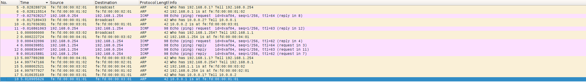

# Practice 2 memo of TCGI

## Exercice 1
### Section 1

```
Every 1,0s: brctl showmacs br3                          Mon M80004 12:15:44
2019
port no mac addr                is local?       ageing timer
  1     fe:fd:00:00:02:00       no                 6.00
  4     fe:fd:00:00:06:00       no                 6.00
  1     fe:fd:00:00:09:00       yes                0.00
  2     fe:fd:00:00:09:01       yes                0.00
  3     fe:fd:00:00:09:02       yes                0.00
  4     fe:fd:00:00:09:03       yes                0.00

```

```
Every 1,0s: brctl showmacs br2                          Mon M40004 12:16:34
2019
port no mac addr                is local?       ageing timer
  2     fe:fd:00:00:02:00       no                31.20
  1     fe:fd:00:00:06:00       no                31.20
  1     fe:fd:00:00:08:00       yes                0.00
  2     fe:fd:00:00:08:01       yes                0.00
  3     fe:fd:00:00:08:02       yes                0.00

```

### Section 2

After removing the br1 from L1, we run the following commans to confucure Alice's machine:

```
root@alice:~# ifconfig eth0 192.168.100.2
root@alice:~# route add -net 192.168.101.0/24 gw 192.168.100.1
root@alice:~# route add -net 192.168.102.0/24 gw 192.168.100.1
```

Then we configure L1 as a router:

```
root@L1:~# echo 1 > /proc/sys/net/ipv4/ip_forward
root@L1:~# ifconfig eth0 192.168.100.1/24
root@L1:~# ifconfig eth1 192.168.101.1/24
root@L1:~# ifconfig eth2 192.168.102.1/24

```

After Alice it was Bob's turn:

```
root@bob:~# ifconfig eth0 192.168.102.2
root@bob:~# route add -net 192.168.100.0/24 gw 192.168.102.1
root@bob:~# route add -net 192.168.101.0/24 gw 192.168.102.1

```

When we send the ping from Alice to Bob, this is what happens:
* Alice's framenters the switch, due to the fact that it can not relate the ip
	to any phisical address, using the ARP protocol, the  router sends a
	broadcast ethernet frame.
* Bob's machine recives this frame and responds with another ethernet package.
* Now Alice's frame  grets forwarded through SimNet 2 to the L3 switch which at
	this time knows exacly where Bob is. Because of that, it gets captured only
	again in SimNet3 where it arrives to its destination. 
* Now Bob sends his response. To do so, he sends it directly with the router's
	@MAC.
* After it arrives to the router, it get sent again directly to Alice.
* The last step is performed by Bob's machine. It runs an ARP to list as
	reachable the gateway (hence the 5 seconds delay)

If we run `arp -v` on L1 after the transmission, we can see that both users @IP have been listed:

```
Every 1,0s: arp -v                                      Mon Mar  4 15:52:26
2019

Address                  HWtype  HWaddress           Flags Mask
Iface
192.168.102.2            ether   fe:fd:00:00:02:00   C                     eth2
192.168.100.2            ether   fe:fd:00:00:01:00   C                     eth0
Entries: 2      Skipped: 0      Found: 2
```
Here there is a screen capture of Wireshark in this scenario:



***Note:*** _Due to the obvious resemblance of both cases, I did skip Bob to
Frank_

## Exercice 2
### Section 1
The maximum mask is `255.255.255.0` (done by translating the different @IP
values to binary and comparing).

## Section 2
After executing both pings, these are the outputs for `arp n`:

```
virt1:~# arp -n
Address                  HWtype  HWaddress           Flags Mask
192.168.0.96             ether   FE:FD:00:00:02:01   C
```
```
virt2:~# arp -n
Address                  HWtype  HWaddress           Flags Mask
192.168.0.32             ether   FE:FD:00:00:01:01   C                     eth1
```

As it can be seen, both machines have each other. Not lets take a look on
Wireshark:



* The first six captured frames where generated by the first ping whereas the
	last two of them correspond to the second one. They follow the same patter
	as explained on exercice 1.
* Due to the fact that the first ping was satisfactory, the second one only had
	to send the ICMP frames and no ARP packages where sent.

### Section 3
If we delete the entry on `virt1` and resent a ping to `virt2` before teh entry
on `virt2` gets deleted, the second ARP frames are not send. Those whould
correspond to `virt2` transitioning its entry on `virt1` form _Stale_ to
_Probe_ after the 5s delay. But it gets to _Rechable_ directñy due to teh fact
that it reveives the second ping.

### Section 4
After adding a wrong entry to the ARP table:

```
virt1:~# arp -s 192.168.0.96 00:70:48:29:5c:99 temp
virt1:~# arp -v
Address                  HWtype  HWaddress           Flags Mask
Iface
192.168.0.96             ether   00:70:48:29:5C:99   C                     eth1
Entries: 1      Skipped: 0      Found: 1
```

We sent one ping with the following output:

```
virt1:~# ping 192.168.0.96 -c1
PING 192.168.0.96 (192.168.0.96) 56(84) bytes of data.

--- 192.168.0.96 ping statistics ---
1 packets transmitted, 0 received, 100% packet loss, time 0ms
```

And after 8s another one:

```
virt1:~# ping 192.168.0.96 -c1
PING 192.168.0.96 (192.168.0.96) 56(84) bytes of data.
64 bytes from 192.168.0.96: icmp_seq=1 ttl=64 time=21.0 ms

--- 192.168.0.96 ping statistics ---
1 packets transmitted, 1 received, 0% packet loss, time 0ms
rtt min/avg/max/mdev = 21.084/21.084/21.084/0.000 ms
```

And these was the trafic captured by wireshark:




These are the conclusions:

* The first ping gets lost because the @MAC was wrong.
* Then `virt1` proceeds to try to confirm if `virt2` is rechable. It sends an
	unicast ARP frame to `virt2` fake @MAC four times, one per second with no response.
* After not recieving any kind on response form `virt2`, it sends a fifth ARP
	frame. Now to broadcast and gets a response. After that it updates the ARP
	table with the correct @MAC
* The following pings are succesfull. The only ARP discovery is executed by
	`virt2`

### Section 5
The apropiate subnet mask is `255.255.255.128`.

### Section 6
The smallest mask to divide all machines into differnt networks would be
`255.255.255.192`.

### Section 7
The results are shown on the following table:

| To\Form |             Virt1             | Virt2 |
|:-------:|:-----------------------------:|:-----:|
|  Virt1  |               -               |  OK!  |
|  Virt2  |              OK!              |   -   |
|  Virt3  |              OK!              |   X   |
|  Virt4  |  Only transmited, no response |   X   |

## Exercice 3
### Section 1
Now, by configuring `virt1` and `virt3` as routers, the comunication between
`virt2` and `virt4` is possible. Here is a list of what happens:

1. First of all, `vlan2` executes the ARP protocol to find out who is the owner
   of the gateway (`vlan1`) @IP because `virt4` is not on the same net.
2. Once it has the required informatiorn, it sends the ICMP frame to the
   before mentioned machine.
3. Now the router asks again who has `virt4`'s @IP. It is `virt4` who responds.
   These is possible because it is done through **L2**.
4. Now the router sends the ICMP frame to `virt4`.
5. The response path follows the same pattern but insted of going through
   `virt1` goes through `virt3` (refer to the table).

***Note:*** _There are no ARP frames sent at the end because the protocol was
triggered before._



### Section 2
Now, by using the `virt1` machine as a router for both networks using the
command `ifconfig` on `eth1` and `eth1:0` we can also succesfuly stablish the
communication between both machines. Here there is a description of what
happens:
1. First of all `virt2` calls ARP to resolve the routers @MAC. 
2. Once done, it sends the frame to the router.
3. This machine now resolves `virt4` @MAC **but** through the @IP on `virt4`
   net.
4. When it receives the @MAC, the router delivers the package.
5. The response does not trigger any ARP discovery and is transmited throu the
   router to the `virt2` machine.
6. At the end, `virt4` executes a ARP unicast request to `virt1` and `virt1` to
   `virt2` in order to validate the table entries.

These are the `arp -n` outputs after the experiment:

```
virt4:~# arp -n
Address                  HWtype  HWaddress           Flags Mask
192.168.0.232            ether   FE:FD:00:00:01:01   C                     eth1
```
```
virt2:~# arp -n
Address                  HWtype  HWaddress           Flags Mask
192.168.0.32             ether   FE:FD:00:00:01:01   C                     eth1
```
```
virt1:~# arp -n
Address                  HWtype  HWaddress           Flags Mask
192.168.0.96             ether   FE:FD:00:00:02:01   C                     eth1
192.168.0.224            ether   FE:FD:00:00:04:01   C                     eth1
```
## Exercice 4
Just configure as the figure. Do not forget to set up the routers routes asn
the default gateways.

## Exercise 5
### Section 1
The apropiate net masks would be `255.255.255.0` which is equivalent to `\24`
and `\28`.

### Section 2
The procedure is the same as always. Here there's a screencapture of wireshark
on SimNets 1, 2 and 3:




### Section 3
By running the given commands, we get this outputs:

This first command, it just works!

```
host1:~# ping -c1 -r 192.168.0.1 10.0.0.3 192.168.2.254
PING 192.168.2.254 (192.168.2.254) 56(124) bytes of data.
64 bytes from 192.168.2.254: icmp_seq=1 ttl=62 time=41.6 ms
SSRR:   10.0.0.3
        192.168.0.1


--- 192.168.2.254 ping statistics ---
1 packets transmitted, 1 received, 0% packet loss, time 0ms
rtt min/avg/max/mdev = 41.686/41.686/41.686/0.000 ms
```

The second one does not get the response. This is due to the fact that the path
of it is not defined on the router 3.

```
host1:~# ping -c1 -r 192.168.0.1 192.168.2.254
PING 192.168.2.254 (192.168.2.254) 56(124) bytes of data.

--- 192.168.2.254 ping statistics ---
1 packets transmitted, 0 received, 100% packet loss, time 0ms
```

The third one fails because the first hop can not be done from the host, it
must go through the gw:

```
host1:~# ping -c1 -r 10.0.0.3 192.168.2.254
PING 192.168.2.254 (192.168.2.254) 56(124) bytes of data.
ping: sendmsg: Network is unreachable
```
### 
