<!--
To include in cheatsheet
* netcat command information
* Where config files are
* Exercice 4
* Exercice 6
* FTP usage
-->

# Practice 1 memo of TCGI

## Exercice 1
By running `cat /etc/services | grep daytime` we get a similar output to this
one on each machine:

```
daytime         13/tcp
daytime         13/udp
```
We can conclude that the service daytime is running, for both L4 protocols, on
port 13. In a windows machine we supose that it could be runnin on the same
port due to the universal nature of L4 protocols.

Provided that the @MAC is located on the same line as the interface id on
`ifconfi`, we run `ifconfig | grep HWaddr` and got the following results:

**On Virt0**
```
eth0      Link encap:Ethernet  HWaddr fe:fd:00:00:01:00  
```

**On Virt1**
```
eth0      Link encap:Ethernet  HWaddr fe:fd:00:00:02:00  
```
A similar aproach is taken for the @IP, we run `ifconfig | grep "inet a"`

The `lo` interface is is used for aplications that do not leave the localhost.
It does not have a HWaddr because of its nature. The filosophy behind `loopback` is to avoid 
using the lower levels (L2 and L1) so the frame never leaves the machine.

## Exercice 2
### Section 1
By running the `netstat -tnlp` comand on `virt1`, we get the following output:

```
root@virt1:~# netstat -tnlp
Active Internet connections (only servers)
Proto Recv-Q Send-Q Local Address           Foreign Address         State
PID/Program name
tcp        0      0 0.0.0.0:111             0.0.0.0:*               LISTEN
641/portmap
tcp        0      0 0.0.0.0:113             0.0.0.0:*               LISTEN
1435/inetd
tcp        0      0 0.0.0.0:21              0.0.0.0:*               LISTEN
1435/inetd
tcp        0      0 0.0.0.0:22              0.0.0.0:*               LISTEN
1247/sshd
tcp        0      0 127.0.0.1:25            0.0.0.0:*               LISTEN
1195/exim4
tcp        0      0 0.0.0.0:40605           0.0.0.0:*               LISTEN
653/rpc.statd
tcp6       0      0 :::80                   :::*                    LISTEN
828/apache2
tcp6       0      0 :::22                   :::*                    LISTEN
1247/sshd
tcp6       0      0 ::1:25                  :::*                    LISTEN
1195/exim4

```

After taking a look on the `inetd` configuration file, we can see that all of
its lines except from two are commented. Those two are dedicated to ftp on TCP
they are listed on `netsat -tnlp` under ports 21 and 22. 

### Section 2
Now, to start the `daytime` service, we can uncomment the line from the
`/etc/inetd.conf`. After editing the file, we run `service openbsd-inetd stop`
and then `service openbsd-inetd start` to make sure the restart was done
properly.

Now we can see the `daytime` service listed under the `netsat -tnlp` command.
So from `virt2` we run `nc 10.1.1.1 13` and we get the following output:

```
Sun Mar 17 17:52:10 2019
```
Which is indeed what we expected.

### Section 3
To check if the `ssh` daemon is listening to port 22, we run `netcat -tnlp` and we get
the following output :

```
root@virt1:~# netstat -tnlp | grep ssh
tcp        0      0 0.0.0.0:22              0.0.0.0:*               LISTEN		1247/sshd       
tcp6       0      0 :::22                   :::*                    LISTEN		1247/sshd 
```

We can now asure that `sshd` is listening on `virt1`. To stop it, we run this
command `service ssh stop`. And now it does not get listed.

### Section 4
In order to change the `sshd` port, we edit the `sshd` configuration file located at `/etc/ssh/sshd_config` file and change
the `sshd` port vale from `22` to `2222`. The changes take efect once we
restart the daemon. After checking that it is working as intended, we restore
to default and restart.

## Exercice 3
### Section 1
The command `nc -l -p 12345` creates a `TCP` socket that listens to the port
`1234` so it is a server indeed. To see what port is in use by `nc`, on `tty2`
we run `nc -l -p 12345` and get the following output:

```
root@virt1:~# netstat -tnpl | grep nc
tcp        0      0 0.0.0.0:12345           0.0.0.0:*               LISTEN
1613/nc         
tcp6       0      0 :::12345                :::*                    LISTEN
1613/nc   
```
Apart form the port, we also get the `PID` which is `1613`. So now we can run
`lsof -a -p 1613 -d0-10` (-a means AND the following flags, -p the `PID` and -d
the entries delimiations). The results are the following:

```

t@virt1:~# lsof -a -p 1613 -d0-10
COMMAND  PID USER   FD   TYPE DEVICE SIZE/OFF NODE NAME
nc      1613 root    0u   CHR    4,0      0t0  362 /dev/tty0
nc      1613 root    1u   CHR    4,0      0t0  362 /dev/tty0
nc      1613 root    2u   CHR    4,0      0t0  362 /dev/tty0
nc      1613 root    3u  IPv6   3235      0t0  TCP *:12345 (LISTEN)
nc      1613 root    4u  IPv4   3236      0t0  TCP *:12345 (LISTEN)
```

As it can be seen on the last entry, there is a `TCP` file descriptor
listening to the port `12345`.

To determine the open files in the client `netcat` process, we run `netstat -tnp
| grep nc` and saw that the local port was `38729`. By retrieveing the `PID`,
we once again run `lsof -a -p1214 -d0-10` and this was the output:
```
root@virt2:~# lsof -a -p 1240 -d0-10
COMMAND  PID USER   FD   TYPE DEVICE SIZE/OFF NODE NAME
nc      1240 root    0u   CHR    4,1      0t0  513 /dev/tty1
nc      1240 root    1u   CHR    4,1      0t0  513 /dev/tty1
nc      1240 root    2u   CHR    4,1      0t0  513 /dev/tty1
nc      1240 root    3u  IPv4   1766      0t0  TCP 10.1.1.2:38729->10.1.1.1:12345 (ESTABLISHED)
nc      1240 root    4u   CHR    4,1      0t0  513 /dev/tty1
nc      1240 root    5u   CHR    4,1      0t0  513 /dev/tty1
```

The fourth one is the `nc` `TPC` file descriptor.

If we now analyze the captured tarfic we can see that:
* The connenction is started by `virt2` with a `TCP` segment of `SYN`.
* Then `virt1` sends its reply with its `SYN` and `ACK`. Now the connection is
	stablished.
* Then, if we send a string from `virt1` to `virt2`, we capture the message and
	its `ACK`. By checking the different parameters (using `follow TCP stream`) we can conclude that:
	* The first message is sent by the cleint to the server with message
		`helloo`
	* The second one goes the other way arrount with payload `.[A.[Ahhhhhhh]]`.
	* We can see that every message has its `ACK`.

The `follow TCP stream` option allows us to see the decoded messages (ASCII)
and the conversation as a whole or filtered by user.

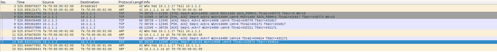

### Section 2
To set up the required scenario, we run `cat /etc/services | nc -l -p 23456 -q0` on `virt1`. 
To retrieve the file on `virt2` we run `nc 10.1.1.1 23456 > file.txt`. Now we
analyze the captured packets using `follow TCP Stream`:

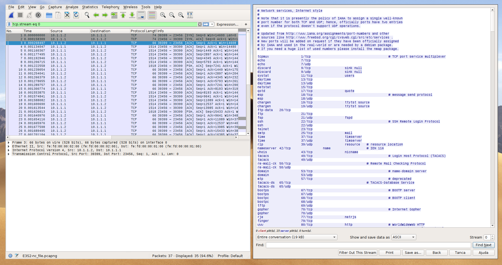

As it can be seen, the information is sent in plan text in multiple frames of
maximum lenght of 1514 bytes. The codification is `ANSI`. 

### Section 3
Now we set up the `UDP` adding the `-u` flag to the before mentioned commands.
As it can be seen on the following image is:
* Now by using `UDP` no `ACK` are sent.
* The `UDP` protocol uses the maximum bandwith all the time.
* There is an issue at the end, probably due to the client trying to reache the
	server while closed.

### Section 4
In orfer to set up the descrived scenario on the physical host, we run on one
terminal `date | nc -l -p 12345` and in another one `nc 127.0.0.1 12345`.

In order to capture the traffic, we sniff at the `loopback` interface. The date
is correcte due to the fact the my physical host has been set up correctly.

### Section 5
By running a similar command with `df -h` the service works as expected.

## Exercice 4
The steps are the following:
* First create the script and give it executions permision
* Then edit `/etc/inetd.conf` to add the line `space stream tcp nowait root
	/root/space.sh`
* We assign the `22233` port to the service by editing `/etc/services`
* Now we manualy restart the deamon.

We can now check if it is workig by running `nc 127.0.0.1 22233`. To debug, run ` tail -f /var/log/daemon.log`

## Exercice 5
To start the we server we run `virt1.0# /etc/init.d/apache2 start 2>
/dev/null`. Now we check if it is included on `inetd` configuration file, and
it's not. To find out the proces id, we first run `netstat -lntp` and `grep`
for 80 port. We find that the `PID` is 808 and it is not linked to `inetd` as
expected. After editing the contents of `/var/www/index.html`, the `lynx` command woks as expected.

Now we capture the frames form `virt1` to the `phyhost`. Here there is the
result:

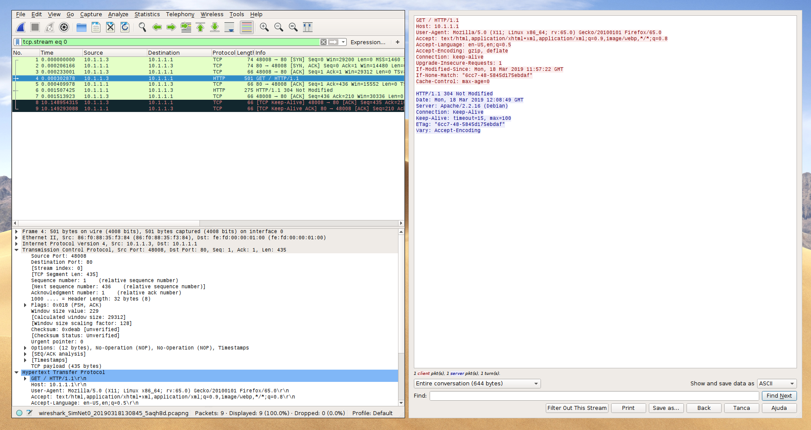

* First there is a `SYN` fraem sent from teh physical host with a `SYN`
	response form `virt1` followed by an `ACK` from the first host. The
	connection is now stablished.
* Now the phisical host sends an HTTP get request and the `virt1` responds with
	an `ACK` and the HTTP response.

## Exercice 6
Now we try to `TELNET` the `virt2` form `virt2`. It does not work, yielding
this output:

```
root@virt1:~# telnet 10.1.1.2
Trying 10.1.1.2...
Connected to 10.1.1.2.
Escape character is '^]'.
Debian GNU/Linux 6.0
virt2 login: root

Login incorrect
```

This is because root can no be used remotely for security reasons. To enable
it, we edited `/etc/securetty` the `pts/(1 and 0)` lines. We also have to edit
`/etc/inetd.conf` file and uncoment the TELNET. Now the connection can
be stablished. 

Now we can log in and send some commands. As it can be seen if we follow the
`TCP` on wireshark, we can see the plain text:


As we can see on the image, the security of the protocol is **VERY** weak. All
the information is shared in plaintext, even the password.

We can check the used ports by running:

```
root@virt1:~# netstat -ntp | grep tel
tcp        0      0 10.1.1.1:23             10.1.1.2:37463          ESTABLISHED
1527/in.telnetd: 
```

Now we check the file descriptors, on the client and in the TELNET session:

```
root@virt1:~# lsof -a -p 1527 -d0-10
COMMAND    PID USER   FD   TYPE     DEVICE SIZE/OFF NODE NAME
in.telnet 1527 root    0u  IPv4       2812      0t0  TCP
10.1.1.1:telnet->10.1.1.2:37463 (ESTABLISHED)
in.telnet 1527 root    1u  IPv4       2812      0t0  TCP
10.1.1.1:telnet->10.1.1.2:37463 (ESTABLISHED)
in.telnet 1527 root    2u  IPv4       2812      0t0  TCP
10.1.1.1:telnet->10.1.1.2:37463 (ESTABLISHED)
in.telnet 1527 root    3u   CHR        5,2      0t0  400 /dev/ptmx
in.telnet 1527 root    5u  unix 0x0cbc1200      0t0 2827 socket
```
We can see that all the file descriptors ar conected to the `TCP`. 

On the `virt2`, if we run `lsof` on the TELNET process we get this output:
```
root@virt2:~# lsof -p 1427 -a -d0-100
COMMAND  PID USER   FD   TYPE DEVICE SIZE/OFF NODE NAME
telnet  1427 root    0u   CHR    4,0      0t0  451 /dev/tty0
telnet  1427 root    1u   CHR    4,0      0t0  451 /dev/tty0
telnet  1427 root    2u   CHR    4,0      0t0  451 /dev/tty0
telnet  1427 root    3u  IPv4   2618      0t0  TCP
10.1.1.2:37463->10.1.1.1:telnet (ESTABLISHED)
```

We can see that the standatd I/O and error file descriptors are connected to
the terminal and a fourth one is the `TCP` socket from which the TELNET
connection is stablished.

## Exercice 7
### Section 1
To open an `FTP` connection we first open the console. Then we type in `open
10.1.1.1`. We get prompted with a login cli and we type root and the password.
The login fails due to the fact that the root user can no use `ftp` by default
for security reasons.

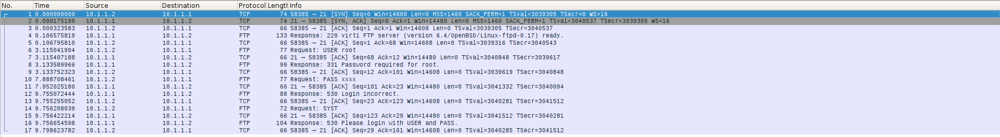

As it can be seen on the capture, the password is also sent in plaitext mode, a
major security thread. If we filter by port, we can see that the only one we
are using is the data `TCP` connection, the one that uses port 21.

### Section 2 and 3
Once fixed the root issue, we can now open the connection. This is the output:
```
ftp> open 10.1.1.1
Connected to 10.1.1.1.
220 virt1 FTP server (Version 6.4/OpenBSD/Linux-ftpd-0.17) ready.
Name (10.1.1.1:root): root
331 Password required for root.
Password:
230- Linux vnx 3.3.8 #1 Sun Nov 6 04:59:42 MST 2016 i686
230- 
230- The programs included with the Debian GNU/Linux system are free software;
230- the exact distribution terms for each program are described in the
230- individual files in /usr/share/doc/*/copyright.
230- 
230- Debian GNU/Linux comes with ABSOLUTELY NO WARRANTY, to the extent
230- permitted by applicable law.
230 User root logged in.
Remote system type is UNIX.
Using binary mode to transfer files.
ftp> 
```
Notice that we are using `binary` mode.

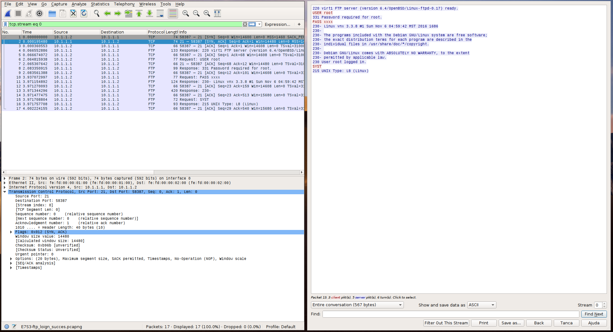

As it can be seen on the image, the login is succesfull. Now we check the file
descriptors from both `ftp` process:

**On the client** `virt2`
```
root@virt2:~# lsof -a -p 1469 -d0-10
COMMAND  PID USER   FD   TYPE DEVICE SIZE/OFF NODE NAME
ftp     1469 root    0u   CHR    4,0      0t0  451 /dev/tty0
ftp     1469 root    1u   CHR    4,0      0t0  451 /dev/tty0
ftp     1469 root    2u   CHR    4,0      0t0  451 /dev/tty0
ftp     1469 root    3u  IPv4   3254      0t0  TCP 10.1.1.2:58387->10.1.1.1:ftp
(ESTABLISHED)
ftp     1469 root    4u  IPv4   3254      0t0  TCP 10.1.1.2:58387->10.1.1.1:ftp
(ESTABLISHED)
ftp     1469 root    5u  IPv4   3254      0t0  TCP 10.1.1.2:58387->10.1.1.1:ftp
(ESTABLISHED)
```

We can see that the first three file descriptors are conected to the stnd I/O.
also there are three `TCP` file descriptors. 

If we now run `netstat -ntp` this is the output:

```
root@virt2:~# netstat -entp
Active Internet connections (w/o servers)
Proto Recv-Q Send-Q Local Address           Foreign Address         State
User       Inode       PID/Program name
tcp        0      0 10.1.1.2:58387          10.1.1.1:21             ESTABLISHED
0          3254        1469/ftp   
```

Whe can see that the only stablished conncetion is the control one due to the
fact that we have not sent any file.


**On the server** `virt1`

If we run `netstat -ntp`, we get the following result:
```
root@virt1:~# netstat -ntp
Active Internet connections (w/o servers)
Proto Recv-Q Send-Q Local Address           Foreign Address         State
PID/Program name
tcp        0      0 10.1.1.1:21             10.1.1.2:58387          ESTABLISHED
1594/in.ftpd: $NetK
```

As seen before, only the data connection. If we analize the open files from
the `FTP` process:

```
root@virt1:~# lsof -a -p 1594 -d0-10
COMMAND  PID USER   FD   TYPE     DEVICE SIZE/OFF NODE NAME
in.ftpd 1594 root    0u  IPv4       3288      0t0  TCP
10.1.1.1:ftp->10.1.1.2:58387 (ESTABLISHED)
in.ftpd 1594 root    1u  IPv4       3288      0t0  TCP
10.1.1.1:ftp->10.1.1.2:58387 (ESTABLISHED)
in.ftpd 1594 root    2w   CHR        1,3      0t0   41 /dev/null
in.ftpd 1594 root    3u  unix 0x0cbc1880      0t0 3292 socket
in.ftpd 1594 root    4w   REG       98,0    40704 5576 /var/log/wtmp
```

We can see that the `stdin` and `stdout` are conected `TCP` file descriptors to
the remote host.

### Section 4 to 6
We can now see that port 20 is user on the file transfer. If we run `netstat`
on the server we can see this output:
```
root@virt1:~# netstat -ntp 
Active Internet connections (w/o servers)
Proto Recv-Q Send-Q Local Address           Foreign Address         State
PID/Program name
tcp        0      0 10.1.1.1:20             10.1.1.2:43475          TIME_WAIT
-               
-               tcp        0      0 10.1.1.1:20             10.1.1.2:49984
	TIME_WAIT   -               
	tcp        0      0 10.1.1.1:20             10.1.1.2:56803
	TIME_WAIT   -               
	tcp        0      0 10.1.1.1:20             10.1.1.2:42715
	TIME_WAIT   -               
	tcp        0      0 10.1.1.1:20             10.1.1.2:54884
	TIME_WAIT   -               
	tcp        0      0 10.1.1.1:20             10.1.1.2:50256
	TIME_WAIT   -               
	tcp        0      0 10.1.1.1:20             10.1.1.2:45472
	TIME_WAIT   -               
	tcp        0      0 10.1.1.1:20             10.1.1.2:56800
	TIME_WAIT   -               
	tcp        0      0 10.1.1.1:21             10.1.1.2:58388
	ESTABLISHED 1621/in.ftpd: $NetK
	tcp        0      0 10.1.1.1:20             10.1.1.2:57637
	TIME_WAIT   -     
```

Where we can also see that the port 20 is been used for the file trasnfer. This
fact can be also checked on wireshark if we use the display filter `tcp.port ==
20`:

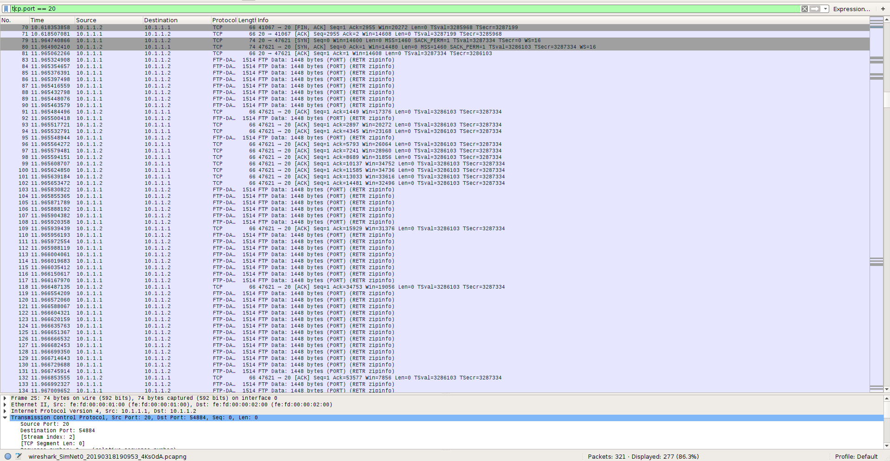

We can see that the only data frames taht get transfered from port 20 are the
data ones and not the control ones as the next image shows:

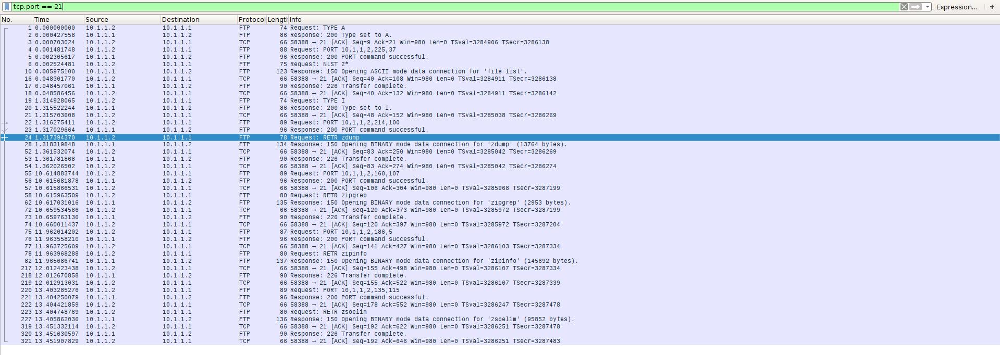

The default data representation of the file transfer is `ASCII`.
As it can be seen, all the datat is sent as plain text:

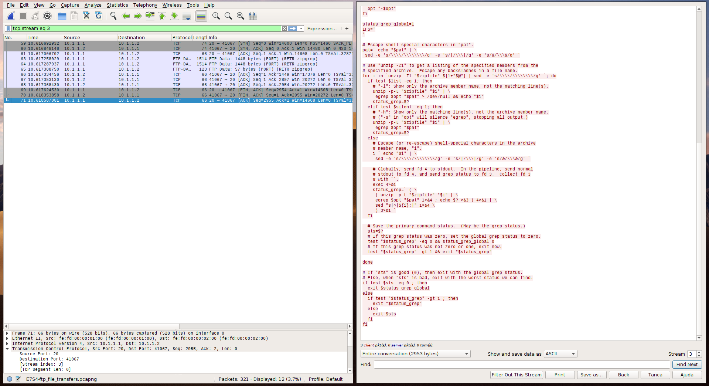

The permisions have changed from `-rwxr-xr-x` to `-rw-r--r--`.

### Section 7
Now the connection is secure so we are not able to sniff the content of any of
the packages. We can see at the begining the key exchange with the
Diffie-Hellman protocol:

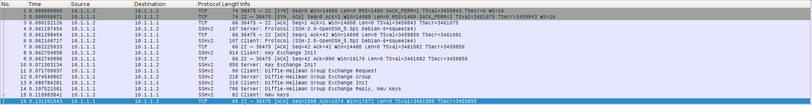

And now all the data frames are sent through the `22` port which is the `SSH`
one and are also encrypted:

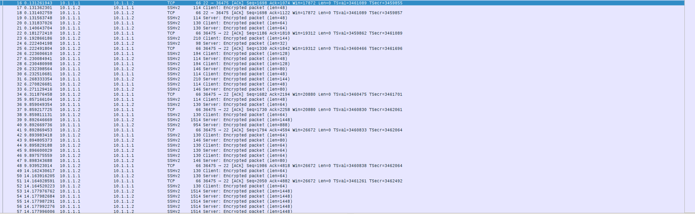

### Section 8
Fistly, we create the file on the physiscal host with `echo "hello world" >
file.txt`. Then we send it to `virt1` by running: 

```
➜  ~ sudo scp file.txt root@10.1.1.1:/root
The authenticity of host '10.1.1.1 (10.1.1.1)' can't be
established.
RSA key fingerprint is
SHA256:mda6mW67VYEewwtOgVnpdW4I7b74zrrXB0Bgk44hUmI.
Are you sure you want to continue connecting (yes/no)?
yes
Warning: Permanently added '10.1.1.1' (RSA) to the list
of known hosts.
root@10.1.1.1's password: 
file.txt
100%   12    25.9KB/s   00:00 
```

After checking that the file was succesfuly sent, all we have to do is to check
the wireshark capture:

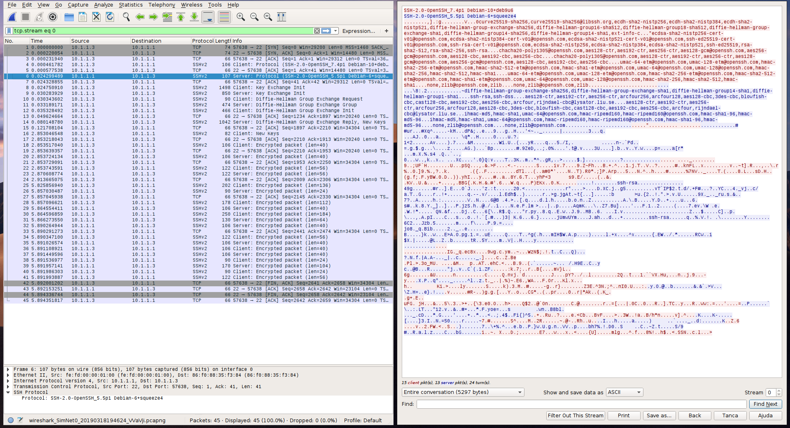

* We are using `SSH` port 22
* We are using Diffie-Hellman protocol
* We cannot see the plain text, only the cipher.

# Issues
* **E1:** Is, on windows, running on the same port?
* ~~**E2S1:** Why ftp is not listed?~~ Use `netstat -tnlp`.
* **E3S1:** Do I have to give more info (explain more the `TCP` protocol)? Also on S2.
* **E6:** Why there's only one TCP socket on the second execution of `lsoft`?
* **E7:** Diferences between data active and passive in ftp? And why there ara
3 FTP file descriptors? Could be possible that 2 are for the `stdin` and
`stdout` of the remote process and the third one for data?.
* **E7S4:** Is the default data representation `ASCII`.

## Author

* **Albert Azemar i Rovira** - *Initial work* -
	[albert752](https://github.com/albert752)

## License

This project is licensed under the MIT License - see the
[LICENSE.md](../LICENSE.md) file for details

