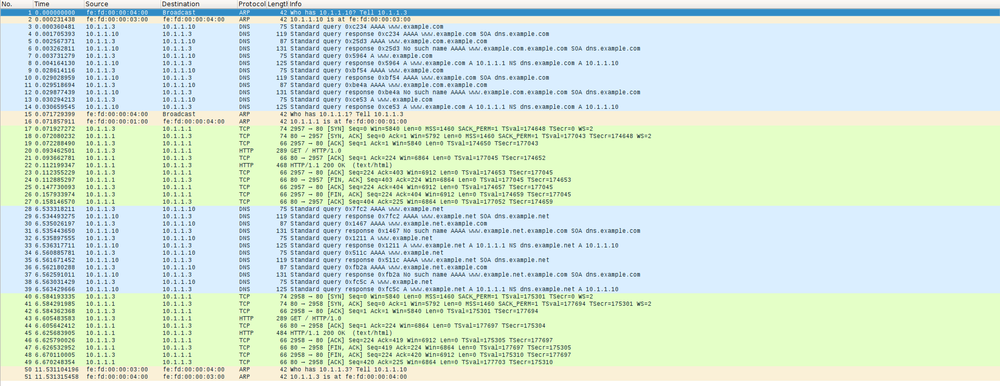

# Practice 6 memo of TCGI
## Exercice 1
We fisrt try to connect to `www.example.com` and we get an error. The @IP
associated with the host is the `10.1.1.1`. If we analyze the capture packets
we can see the TCP error:


As it can also be seen on the capture, it tries to get the `AAAA` rocord for
the host but it is not existent so it then requests the `A` record. We can also
see that the first DNS request times out and it gets repeted. The TCP error is
raised due to the fact that the server is not listening.

Now, by executing `netcat` we can see the following output:

```
www:~# netcat -l -p 8080
GET / HTTP/1.0
Host: www.example.com:8080
Accept: text/html, text/plain, text/css, text/sgml, */*;q=0.01
Accept-Encoding: gzip, compress, bzip2
Accept-Language: en
User-Agent: Lynx/2.8.7dev.9 libwww-FM/2.14 SSL-MM/1.4.1
```

Now the connection is open, when we close the client or the sever it gets
closed.


We can see the same DNS resolution battern but now the TCP connection is
stablished. We can now see the HTTP GET request from the host and the ACK from
the server.

Now, if we start the `apache2` daemon on the server, we can see taht the netcat
works and stablished the TCP connection on port 80. But now we can see some TCP
errors:


If we query the server with lynx, it works without the TCP errors.

In order to perform the `GET` with netcat we first create a file containing the
request and the pipeline it to netcat.

When we try to get `doc.html` we get the followin output:

```
host:~# cat get.txt | nc www.example.com 80
HTTP/1.1 404 Not Found
Date: Mon, 01 Apr 2019 11:06:05 GMT
Server: Apache/2.2.9 (Debian)
Vary: Accept-Encoding
Content-Length: 286
Connection: close
Content-Type: text/html; charset=iso-8859-1

<!DOCTYPE HTML PUBLIC "-//IETF//DTD HTML 2.0//EN">
<html><head>
<title>404 Not Found</title>
</head><body>
<h1>Not Found</h1>
<p>The requested URL /doc.html was not found on this server.</p>
<hr>
<address>Apache/2.2.9 (Debian) Server at www.example.com Port 80</address>
```

The resource `doc.html` does not exist on the server. If we try with the path
`/` it return `index.html` as expected.

When repeting the experiments with the `phyhost` does work as before using the 
@IP but not using the domain name because the `DNS` settings of the `phyhost`
has not been set up

## Exercice 2
After editing the `index.html` file:
```
<html><body><h1>It works!</h1>

</img>
</img>
</img>
</body></html>
```

And moving all the images to the `/images` directory, we can now see the
webpage with the images via firefox.

If we follow the `HTTP` stream, we can see a first `GET` reqeusting the
`index.html` and the another one for each image. The last one tries to get the
`favicon.ico` and gets a `404` beacuse it does not exist. The secon time we
reload the webpage we get a `not modified` response for each `GET` request. If
we further examnine the `GET` headers, we can see the `If-modified since` and
`If-not matched` containing the ETag fields:


Without changing the parametes on firefox, we see that we have 2 TCP open
connections (top image), after changing the parameter to 1, we can only see one
connection:


After changing the firefox parameter to 1, we can only see 1 TCP connection.

In order to retrieve the UPC logo file we execute on the physical hots:

```
➜  ~ nc 10.1.1.1 80 > response.http 
GET /images/upc1.gif HTTP/1.0

➜  ~ cat response.http 
HTTP/1.1 200 OK
Date: Mon, 01 Apr 2019 11:51:15 GMT
Server: Apache/2.2.9 (Debian)
Last-Modified: Mon, 01 Apr 2019 09:58:41 GMT
ETag: "4b87-850-5857510ad1640"
Accept-Ranges: bytes
Content-Length: 2128
Connection: close
Content-Type: image/gif

GIF89a <REST OF THE IMAGE>
```
After editing the file we can now see the UPC logo. 

We repeat the process to retrieve using `HTTP1.1` but now we have to specify
the host as `Host: www.example.com`. If we specify `Connection: close ` it will close the connection

Now we will retrieve the file with `wget`. This command simply creates a get
request to the server in `HTTP/1.1` with the flags `Host` and `Connection:
Keep-alive` so the TCP connection will not be retminated after the transfer.


### Server Set-up
To set up the web server on the `server` host, we run:
```
server:/var/www# /etc/init.d/apache2 start
Starting web server: apache2.
server:/var/www# cat index.html 
<html><body><h1>It works!</h1>
</img>
</img>
</img>
</body></html>
```
And we stop the apache server from `www`

When we request the wepage of the `server` from the `phyhost` we get the html
file with all the image hyperlinks broken. The src is specified with a FQDN
whitch cannont be resolved by the machine due to the DNS. And even if we could,
we have just `stoped` the apache server from `www`.


Now from `host` we try to acces the server webpage. Because we are using
`lynx`, we are only requestig the text files, thus we only get the
`index.html`. To resolve the DNS, it does the standard procedure explained on
the first exercice.

If we now start the server again on `www` and we try tro retrieve the wepage
from the physical host, we get the same output as before due to the `DNS`
configuration. We cannot acces to webpage even by editing hosts.

## Exercise 3
### Bash script
To set up cgi on the server machine, we have to create the forder `cgi-bin`.
There we create a small script the echoes hello and we give it execution
permisions. We now run:

```
a2ensite default
/etc/init.d/apache2 restart
```
To reload the apache configuration. We also have to edit the file
`/etc/apache2/sites-enabled/000-default` and then we change the line that says
`ScriptAlias /cgi-bin/ /usr/lib/cgi-bin/` to `ScriptAlias /cgi-bin/
/var/www/cgi-bin/` now we restart again the apache server and when we exacute
`lynx` on the host, we can retrive the date by going to
`www.example.com/cgi-bin/hello.sh`

### C code
We follow the same procedure to configure the C file. We do have to compile it.
To query the server we use the command `NOT WORKING`.

## Exercise 4
We edit the `db.example.net` file in order to add the 10.1.1.1 IP. We then run:

```
www# cd /etc/apache2/sites-available/j
www# cp default www.example.com
www# cp default www.example.net
```

And then we edit the file to acomodate it to our needs. Then we enable both
sites by running `a2ensite www.example.com/net`. We also have to create the
docoment root directories and write a unique index file for each one.

Now, when we run lynx to `ẁww.example.com` we get the new webpage.
When we browse using the IP we get the old default webpage. This is due to the fact tht the `default` webservice has not been disabled. On
the other hand, for the `.net` domain, we recieve the new `index.html` file.
Even thow we run the comands quickly enough to be able to use the `DNS` cache,
we can see that it performs two full queries. We see this behaviour because
the domain names are different, thus it needs to be again resolved.



After setting up the `DNS` and the web server on the `server` machine, we can
see that now the `DNS` acts like a load balancer.

## Issues
* **E1:** Does the server has a buffer for each TCP message?
* **E3.2:** How to query the server. It is returning remote PID
