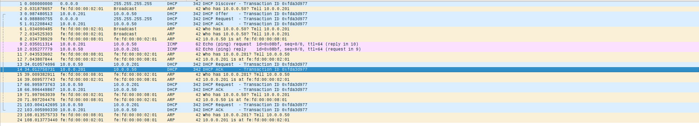
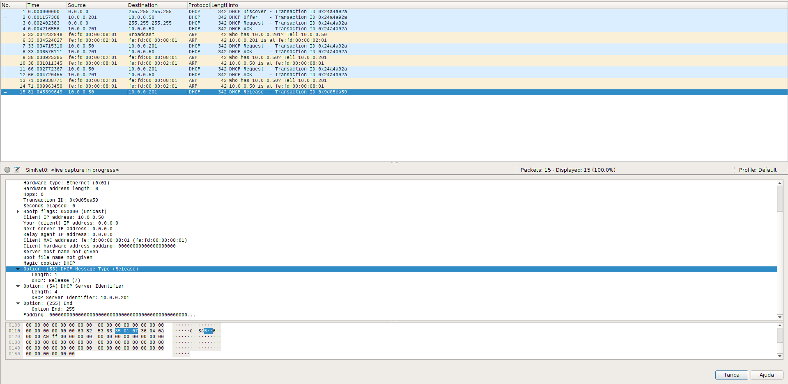
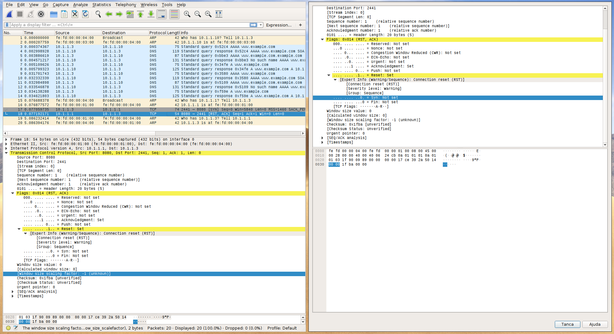
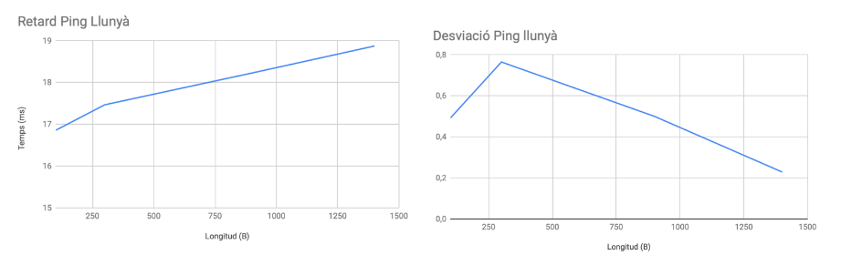

# Practice 6 memo of TCGI
## Exercice 1
We fisrt try to connect to `www.example.com` and we get an error. The @IP
associated with the host is the `10.1.1.1`. If we analyze the capture packets
we can see the TCP error:



As it can also be seen on the capture, it tries to get the `AAAA` rocord for
the host but it is not existent so it then requests the `A` record. We can also
see that the first DNS request times out and it gets repeted. The TCP error is
raised due to the fact that the server is not listening.

Now, by executing `netcat` we can see the following output:

```
www:~# netcat -l -p 8080
GET / HTTP/1.0
Host: www.example.com:8080
Accept: text/html, text/plain, text/css, text/sgml, */*;q=0.01
Accept-Encoding: gzip, compress, bzip2
Accept-Language: en
User-Agent: Lynx/2.8.7dev.9 libwww-FM/2.14 SSL-MM/1.4.1
```

Now the connection is open, when we close the client or the sever it gets
closed.



We can see the same DNS resolution battern but now the TCP connection is
stablished. We can now see the HTTP GET request from the host and the ACK from
the server.

Now, if we start the `apache2` daemon on the server, we can see taht the netcat
works and stablished the TCP connection on port 80. But now we can see some TCP
errors:


If we query the server with lynx, it works without the TCP errors.

In order to perform the `GET` with netcat we first create a file containing the
request and the pipeline it to netcat.

When we try to get `doc.html` we get the followin output:

```
host:~# cat get.txt | nc www.example.com 80
HTTP/1.1 404 Not Found
Date: Mon, 01 Apr 2019 11:06:05 GMT
Server: Apache/2.2.9 (Debian)
Vary: Accept-Encoding
Content-Length: 286
Connection: close
Content-Type: text/html; charset=iso-8859-1

<!DOCTYPE HTML PUBLIC "-//IETF//DTD HTML 2.0//EN">
<html><head>
<title>404 Not Found</title>
</head><body>
<h1>Not Found</h1>
<p>The requested URL /doc.html was not found on this server.</p>
<hr>
<address>Apache/2.2.9 (Debian) Server at www.example.com Port 80</address>
```

The resource `doc.html` does not exist on the server. If we try with the path
`/` it return `index.html` as expected.

When repeting the experiments with the `phyhost` does work as before using the 
@IP but not using the domain name because the `DNS` settings of the `phyhost`
has not been set up

## Exercice 2
After editing the `index.html` file:
```
<html><body><h1>It works!</h1>

</img>
</img>
</img>
</body></html>
```

And moving all the images to the `/images` directory, we can now see the
webpage with the images via firefox.

If we follow the `HTTP` stream, we can see a first `GET` reqeusting the
`index.html` and the another one for each image. The last one tries to get the
`favicon.ico` and gets a `404` beacuse it does not exist. The secon time we
reload the webpage we get a `not modified` response for each `GET` request. If
we further examnine the `GET` headers, we can see the `If-modified since` and
`If-not matched` containing the ETag fields:



Without changing the parametes on firefox, we see that we have 2 TCP open
connections (top image), after changing the parameter to 1, we can only see one
connection:



After changing the firefox parameter to 1, we can only see 1 TCP connection.

In order to retrieve the UPC logo file we execute on the physical hots:

```
➜  ~ nc 10.1.1.1 80 > response.http 
GET /images/upc1.gif HTTP/1.0

➜  ~ cat response.http 
HTTP/1.1 200 OK
Date: Mon, 01 Apr 2019 11:51:15 GMT
Server: Apache/2.2.9 (Debian)
Last-Modified: Mon, 01 Apr 2019 09:58:41 GMT
ETag: "4b87-850-5857510ad1640"
Accept-Ranges: bytes
Content-Length: 2128
Connection: close
Content-Type: image/gif

GIF89a <REST OF THE IMAGE>
```
After editing the file we can now see the UPC logo. 

We repeat the process to retrieve using `HTTP1.1` but now we have to specify
the host. If we specify `Connection: close ` it will close the connection
## Issues
* **E1:** Does teh server has a buffer for each TCP message?
