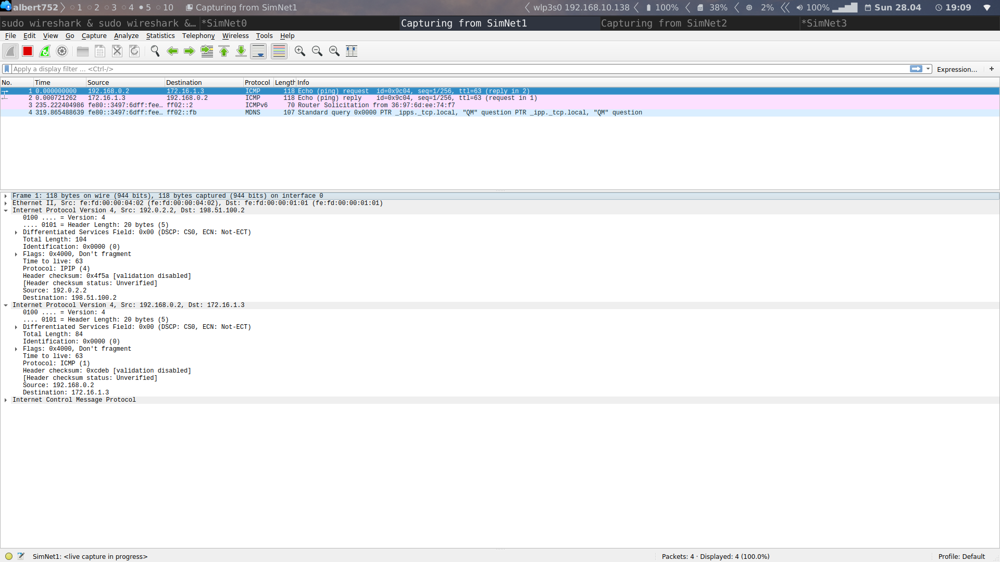
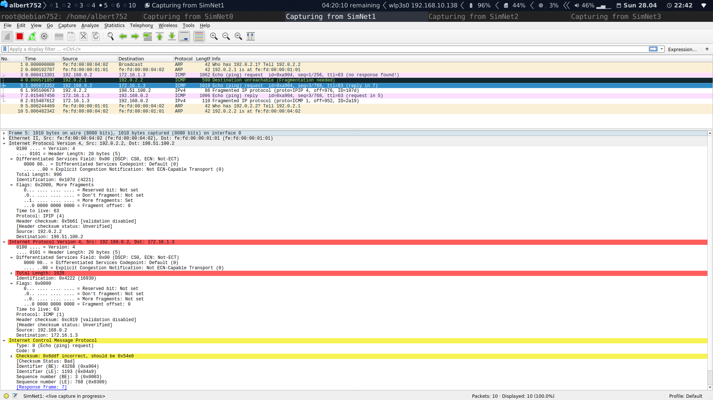

# Practice 8 Memo of TCGI
## Exercice 0.4
In order to configure both endpoints for the `IPIP` tunnel we run the following 
commands for `R2`:

```
R2:~# ip tunnel add tunnel0 mode ipip local 198.51.100.2 remote 192.0.2.2 ttl inherit nopmtudisc dev eth2
R2:~# ifconfig tunnel  1.2.3.4
R2:~# route add -net 192.168.0.0/24 dev tunnel0
```

And for `R1`:

```
R1:~# ip tunnel add tunnel0 mode ipip local 192.0.2.2 remote 198.51.100.2 ttl inherit nopmtudisc dev eth2
R1:~# ifconfig tunnel0 4.3.2.1
R1:~# route add -net 172.16.1.0/24 dev tunnel0
```

## Exercice 0.5
While capturing in all `SimNets` we run `ping -c1 172.16.1.3` on `host2` in
order to reach `host3`.
* The IP frames captured on `SimNet0` and `SimNet3` are the standard ones with
	no modification whatsoever. The src `@IP` thow, is the private one, not the
	public.

* On the other hand, the frames captured on the other two `SimNets` have 2 `IP`
	headers. As it can be seen on the image:


	
	* The source and destination `@IP` of the outer header are the ones from
	the endpoints of the tunnel whereas the `@IP` of the inner header feature
	the private `@IP` of the end hosts.

| TTL          | SimNet0 | SimNet1 | SimNet2 | SimNet3 |
|--------------|:-------:|---------|---------|--------:|
| Outer header |    NA   | 63      | 62      |      NA |
| Inner header |    64   | 63      | 63      |      62 |

The results of the `TTL` can be seen in the top table. Thanks to the option
`inherit`, the outer hearder inherits the inner header `TTL` when entering the
tunnel and the inner header decrements value for the `TTL` when
exiting the tunnel. During transfer, only the outer `TTL` gets modified, the
inner remains frozen.

In order to evaluate the value of the `TTL`, we are going to perform several
pings increasing the field:

#### TTL=1
The packet gets droped at the first hop, the `R1`. No outer header gets created
because it is not transfered tothe tunnel. The `ICMP` error message is the
`time to live exeeded` generated by `R1`. We only see trafic on `SimNet0`.

#### TTL=2
As before, the ping did not reach the destination. It was lost on the `RS`
router. 

The `ICMP` message is the same as before but now it's generated by `RS` and
only seen on `SimNet1`. This frame has as origin `192.0.2.1` and as destination
`192.0.2.2`. The `ICMP` message does not get ralayed backwards to the host (we
don't see it on `SimNet0`) because the expired `TTL` belogs to the 
outer header. We do not see a `soft state` beacuse no message has
been sent from the encapsulator to the sender. We do see a behabiour compliant
with the `RFC 2003` because no messages have been sent to `host2`.

#### TTL=3
Now the response is received succesfuly. We do see the `ICMP` reply.

## Exercice 6
### Section 1
The `MTU` of the tunnel interfaces is `1480` bytes. We assume its because the
L2 protocol is ethernet, so the `MTU` is 1500 minus the outer header of `20`
bytes. Now we restinc the `MTU` for `SimNet2` to 996 bytes.

After restablishing the tunnel, we can see taht the mtu on `R1` is still `1480`
but on the other side now has the expected value of `976`, 20B less that the
one set up for the link.

### Section 2
So by running `ping -c1 -s500 -M want 172.16.1.3` we set a payload length of
500 bytes, and 1 to the dont fragment flag. This option only allows
fragmentatio locally, not in path.

We can see two ICMP frames on each `SimNet`, one for the request and the other
one for the reply. The sizes on the private networks are 542B whereas on the
tunnel, thanks to the outer header, 562B. 

The packets have not been fragmented because they do not exceed the 
minimum `MTU` (996B) and as expected the `DF` flag is set to 1 on the outer and
inner headers of the request.

### Section 3
Now we allow fragmentation in path: `ping -c1 -s500 -M dont 172.16.1.3`.

The results are identical with the `DF` flag set to 0 in all headers.

### Section 4
Now we execute: `ping -c1 -s500 -M do 172.16.1.3`. This option prohibits all
fragmentation, even local one. Again, no diference.

In order to have the maximumsize allowed, we need to send a ping with parameter
`-s948` which resultrs from 996-20-20-8.

### The -M want option
After clearing the cache, we run `host2:~# ping -c1 -s1000 -M want 172.16.1.3`.
The ping is not succesfull. 

We can see the fisrt `ICMP` frame in `SimNet0`, then inside `SimNet1`, it gets droped 
and notified to `R1` with an `ICMP` frame due to its size.

The lengths are 542 in the private nets and 562 in the transport
ones. This length does exceed the minimum `MTU`.

All IP headers except from the `ICMP` error one have DF set to 1 (inner and
outer).

The error is originated on `RF` and notified to `R1`. The notified mtu is 996.

In my humble opinion, the destination should be `host2`. It is not acting as
expected because an error code `4` should be notified to the sender.

#### Soft State
After runnin `ping -c2 -s1000 -M want -i1 172.16.1.3` we can see the following
output:

```
host2:~#  ping -c2 -s1000 -M want -i1 172.16.1.3
PING 172.16.1.3 (172.16.1.3) 1000(1028) bytes of data.
From 192.168.0.1 icmp_seq=2 Frag needed and DF set (mtu = 976)

--- 172.16.1.3 ping statistics ---
2 packets transmitted, 0 received, +1 errors, 100% packet loss, time 1009ms
```

We can now see an error pop up. If we analize the captured traffic, we can
observe that the first `ICMP ping request` message gets discarted on `RS`. Is
this router who notifies then `R1` as before. The difference comes with the
second frame, this one gets droped at `R1` and is this router who notifies
`host2` that the length is exceeding the `MTU`. We can't see the second frame
on `SimNet2`.

The DF is set on all `ICMP ping request` frames.
We can now conclude that `R1` mantains a soft state of the `MTU`. We can
retrieve it by running `ip route show cache`:

```
local 192.0.2.2 from 192.0.2.1 dev lo  src 192.0.2.2
    cache <local,src-direct>  iif eth2
192.168.0.2 dev eth1  src 192.168.0.1
    cache  ipid 0x0b79
172.16.1.3 dev tunnel0  src 192.0.2.2
    cache  expires 179sec ipid 0xc69d mtu 976
198.51.100.2 from 192.0.2.2 via 192.0.2.1 dev eth2
    cache  expires 178sec ipid 0x107c mtu 996
```

It reads: in order to arrive to @IP1 from @IP2 via @IP3, this restrictions are
aplied. It has an expiration time.

Now, by increasing the count to three, we can see that the third try succeds.

By analising the camptured traffic, we can see taht the third ping does not
have the DF activated and comes fragmented from `host2` (MF activated on in the
first piece).

##### SimNet0
The sizes of the fragmnets are 986 and 90 each. (With the ethernet header)

##### SimNet1
The sizes of the fragmnets are 1010 and 110 each (with the ethernet header).
Provided that the ethernet header size is 14B, neigder of these frames exceed
the minimum `MTU`.

The fragmentations in `SimNet1` and `SimNet0` are different because in `SimNet1`
a 20 byte header must be added. The new outer header must have track of both 
fragments with the fragment offset field (which now keeps also track of 
the inner header). In order to have data sizes multiple of 8, four bytes 
from the second fragment are moved to the first one. This ca be done becaus
DF is disabled.

##### SimNet3
We see the same ICMP requests as in SimNet2.

All the fragmented framges have DF disabled-

The ICMP response fragments fit natively the MTU of the tunnel.



Finally, we run `ping -c2 -s 1460 -M want -i1 172.16.1.3`:

The scond request is the one that succeds. Because it exceeds the MTU of the
first link, the `R1` generated the error right away so the next message gets
fragmented from the `host2` for a mtu of 1480. This fragmentation puts the DF
to 0 so on `RS` the fragments get resized to fit the channel. The respons fits
the minimum `MTU` natively.
## Problems

* **0.5, TTL=2:** Is it correct the behabiour I'm seeing? What is `soft state`?
* **0.6, s4:** Host is getting ICMP error messages.
* **0.6, the -M want:** Is acting correctly? We dont see soft state.
* The weird reports with diff fragmentations from the request to the respone.
